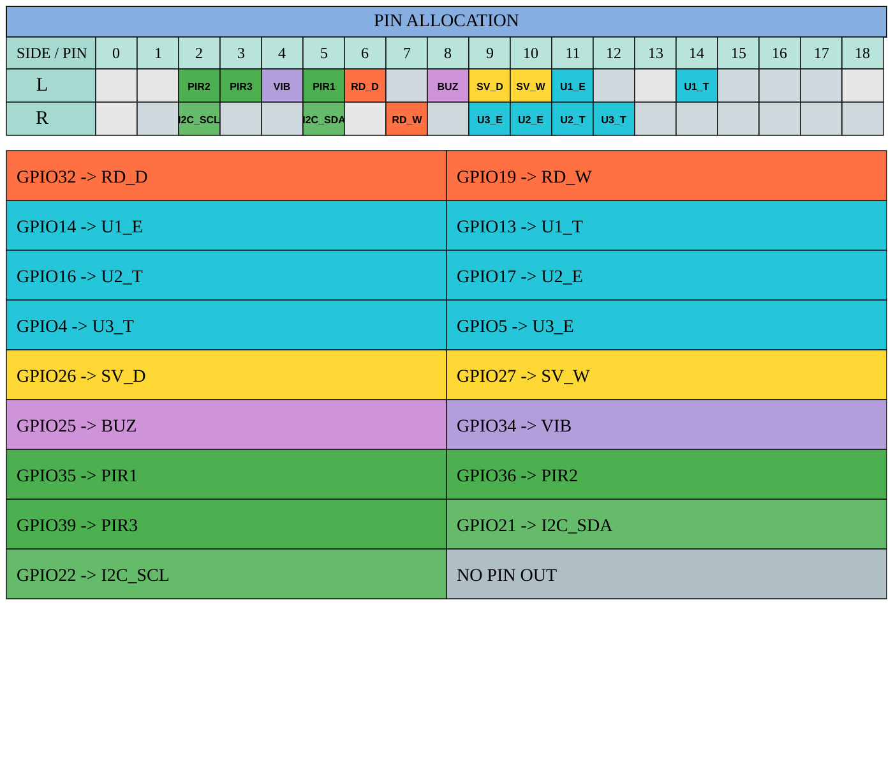
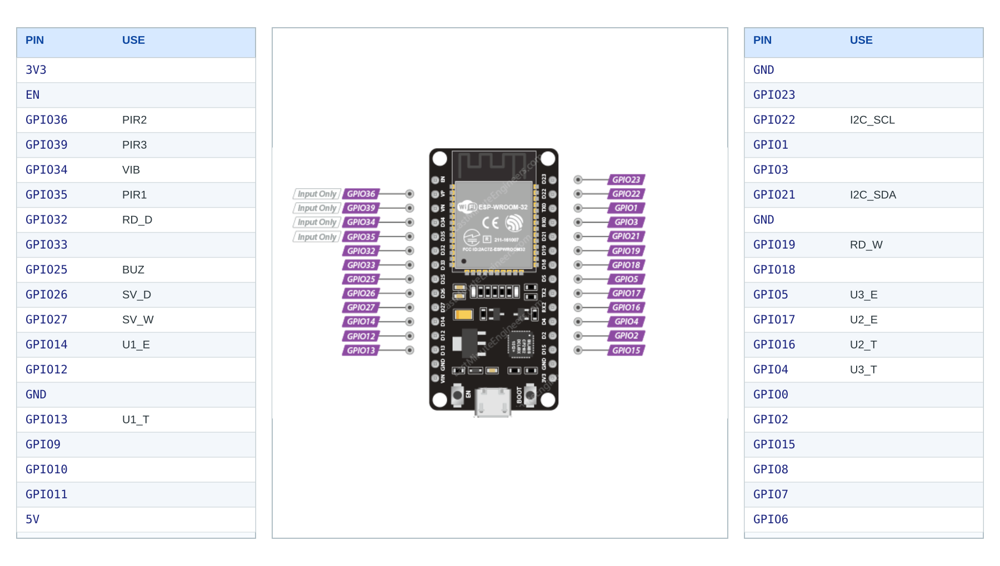
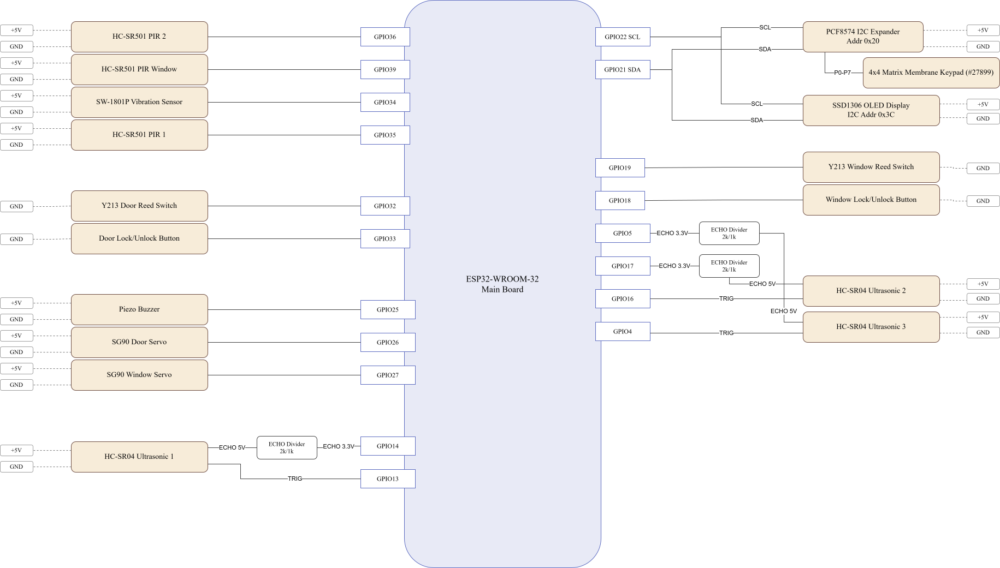

# EmbeddedSecurityHome

An ESP32-based smart home security system running FreeRTOS, integrated with LINE OA for real-time notifications and remote control via MQTT.

This document serves as the Single Source of Truth for:
- Understanding the system scope and logic.
- End-to-end installation and deployment.
- Pre-delivery architectural validation.

---

## 1. Core Features

- **Security Modes:** Supports 3 primary modes: `Disarm`, `Away`, and `Night`.
- **Intrusion Detection:** Monitors events via a sensor array:
  - `Y213` reed switches (door / window)
  - `HC-SR501` PIR motion sensors
  - `SW-1801P` vibration sensor
  - `HC-SR04` ultrasonic sensors (round-robin + timeout execution)
- **Progressive Alert:** Escalating threat logic (`Off -> Warn -> Alert`).
- **Access Control:** `4x4 Matrix Membrane Keypad (#27899)` PIN flow via `PCF8574` (`*` = Backspace, `C` = Clear buffer).
- **Local Physical Override:** Dedicated door and window lock/unlock toggle buttons on `GPIO33` and `GPIO18`.
- **Actuators:** `SG90` mini servos for door/window lock control and a piezo buzzer for warning/alarm output.
- **Remote Control (LINE/MQTT):**
  - LINE rich menu `Controls` opens a quick command helper in chat.
  - Lock/Unlock doors and windows.
  - Mode shifting (`arm_night`, `night_off`).
  - Emergency `help` request with the same effect as keypad button `B`.
  - Temporary buzzer `silence` and system `status` requests.
- **Safe Lock Guard:** Door/window lock commands are rejected with a warning if the target is still open.
- **State Persistence:** Saves critical states (`latest_mode`, `is_night`) to NVS memory for power-loss recovery.
- **Controller:** `ESP32-WROOM-32` with Wi-Fi + Bluetooth.

## 2. System Diagrams

### Architecture


### Runtime Flow

Live view: [Mermaid Flowchart](https://mermaid.live/edit#pako:eNqtWwlz2sgS_ivzSGULNjZGIk4M2ewrGeSENQaC5HgPb6mENAY9C4mVhI84_u-ve2Z0gSTsrEltrRn18fUxPT2j4aFm-TatdWuvXz84nhN1ycNlLVrQJb2sdS9rMzOEP_bE0FczcMyZS0N49oAPret54K89m9G-umIfRr40He_4er41HlLL9-yiJ5a7DiMaFD2i9pwOzRl1j_MKg_nMrMuHh3vxf63GZe0xBtvTNEbVXNIA4NjkgaSAu0QoIP9xlis_iEwv-kAeSXgzfwJd-nzf8l0_KJPWTAlB6pXjuqWUiY0koFaUUEeB6YUrM6BelOPwV6blRPdd0soNh1HgX9Mu8XyPlmvIG1imIseyejqTyyJ1Pd9pQxVYkQ1PcwY-3U88IhUqeWV38F_Bs_1bx44WwLe6K0Gxz0wiEb1Lsbx6xz7VHADWA444R4pYWIJfuf6ttTCDiM-rRbR0mdtxnkXBmgLJbWCuVo43v0CwMCzLLRi1HXMemMuJadvwDIY772DUgxmtoTvYUBuHwHPX6VCn9fj4-Pr1pZcoJnr_0iPwsVwzDPv0iqwC36JhyM19RaWrwyu6J7z5qiUfHdnSXs6B8uruw4YMeoOh4hIg5zvW20TC1cxqyfZOCVgtnMjxvUQKbc3kVMrhe6vV2ikljMyICgm2RW3rKJHw7qhz1T56Ao7l0oRZLFAczWZ2K5FhydLR4Wy3N4LADxI7LNtO7bDb8pV8tVOC6_srA6MbR4V9Ulsk_JeX0l7dxQO2GUKoAxPmyCE53PaRH5hzWhJv6fB9Z7eF__OdNFD4qYTGBXAR4XoGibxakIkyUad_XdbIZe1v_gg_toOFANNAP45Z8PP6Nfn45E-OrdUk2h-arp6RwWigD5Th4E9FH4xH_1r28Xis1-u40kXrVb1BtAin1wCWVsd0nW8mWnFZazTI_v6v5KKvG6gfDE4oKNHN8JpcmJG1sH2Yrn93u10xG1M1MScT09N_N47VT4MRyIEZg4WqOaNzx6s3uiQjWLGitQlxDvfI6Ku2RzCjz77oOtFocONYtERXIp4pA05jqmr6eKr-BXYOfdMmLsyvMDKWmJo_ESc0PGe-gJkf-EukB3tRsEixVHBGFLdjPByqPfgaOwUqpwuB94PYHAZ55nh2L35Sb5Shzglj8tWvuvEFxPYCigWBlacva7ouM5zRM05d0U41ozdVFV1NBWjUYrGqTwLHD2D1ITJHePZPFG08kcpwZkUzXZraMzRdmeoVNBi1mCiXshpMcWqTf9CqrDPO-mB5HT3KChmz-pdZcPBr_WRwMub0bOoC8-w-NcAyXRcX_kZZDNFHU50LTx3KRbs-sHM3h8T33PstKS8xlaUmugxdRM4USNLheDz513KTgoTRQIkQ9TjcZ9DckiHUYlKXW8uwkStV2-UqHk3iiuUhlqV6UXCP9QC8kpZ3DPEnVTf0Qe9UA81g4si_JR_JEiLkhFs5n_eH0iRTuvQhQUW0M4mQSBVpBPNP6UPPgUwrmFOcUcWQ1RssigEXdeUEYbRHbMpTZWneQadlLe2DyLGuoe0GOMlivZF3ZL8p2JqpzpRmqp6NddXoj0dqvU6YJ3AhyVoleBDz98sapNU1sX1YTA8I-_sWCgK4R3yDjL2sfUee4bh3avQ-n4J9uhnMaQSrHDgQumfq_bcUc4ZRKPwDdzypxAtlOmLpEEGVDjzyhszW377RwLiFb8xnX_h0Mh2cTgpgekPwmYH4jJ9ZP7IOeQx5V4DByPihCszIz2LpjwFJn-UblncwpMsQYEX3IUmZbg4HcBxoGc1xT1OlO-P1tZf1u_iWeF58T31_PnoCvnPO9UIIQ3C3h6sYA6ANhsWqebCaUINwfX4p3YKVq9YVvVg318X1kMl6BpN5ARAUnEI_oPWa3q9M21hQdwUxwP8JBJ_V4cSA0gwoptCIQJKyKQ0VJMNiBDgrw0gkIiOIq8L5UC2fgGaw5Cu80DYSkyzbBnz8CGUwBMrKiTbKJLYerGkisBB7Rm8hYuCgHvQJtCkqY10UL0a5R0RvxOtanVdpsjKjxR5sQiMSLWB3O19k-oJ8na2MStaSE9MNU1Om6m8AbKsk4HpYWQLKvM88YPh4OCI0jE9OHjAFm7HnR0iyw_HAtO34qfq12PU8lgRwYhDMW_OeOxEPiGywJdsCNkoTqgRA3l8w_uI-G_mkb0YmTBIQs8_FfC9jxTX0uElO2UwhogfNOTDDyDCcTowJtJsQBFmso5wZF-qSGAgWgW8SYH619jsICx4p_T7Yr6xgobJJ5JMJ9DXHa9j9BtsZqY8x9aol_yzkHiu9UxCMB2nhyrQoqeOCf0NhLe9B59j4Mek9Ib03xK1bz6VmgI0NzK9_DVwRos_OWeO9mZWwGBkL37XZ0mskC0CSftXCj4Vwbaw9t1BWC35FwLwb2HTZQsP4tAQ8nr4afPF8nnTHy8o_UdhqV6phZtpPED-wXTYNj_URG96cFL0m9L7eGnr62TqKfC_TV8YsOAWO-RTgpMec0qiYCjGvQNHHDgM7lwPRHnARCAyqExL3t01dMmUGszjy53O3OAs2VF3w9qVS2UWpMt78PENd7N9p39CgeIynmw7uw1aGeiHYby1MJ1twYg70bw_7e6hMUwplEb1V6tmETQD4DOuCMA1HSzIG2-NCczbFDcF337_D1iTuaKCGeHNqJzZeDEYPqCMGy_29BXdDwwU_acjjvWCnGxtwRQSqAafiduKdSDHcyWBKpF1AJ9I2zolUkC8-2wxK5RgTSbshylmI8k6IcgFEuRSiXAFRfjLEdhbi02I-aRfgbJfibFfgbD8V59fBcQz0qzMLxNFcNU7g2QYKg9tIb5yZEa6ca1oONRVWhfVcM7QLAKrdOpG1IPV1OPBtesteogMpYhOgedGikxQVJolGHv4geOPM5Daj9X1L_5SM5tJblFVpwbvSLYPl5QbZbi2tpswMEQINRD4kFeqCTSg7E8spYb1jlG5Sbaycq3CBxHjlxg_xMN8glbpAL3SAXu0HOuUEudYP8TDfIT3WDzHnaiRvaz3RDu8QN7UI3tIvd0M65oVXqhvYz3dAucQMusGoTF_v4UJJQjx1L5fohPND8bTwY5c-isit6NYWmjrTxdAcRIK0mGI57yrCEJgcXG-N4DxKT5wigua18Pj6tfIyd5TZB9vyXt2SMJuudLZKLApIcUdxZbLowRyRW80oavppWk8i7Sdo7SUQB36bJRTqpUJmobxLIuwja2wSFacvI8tlTnL2VhBsGVdJmMBXSlSV18kpGHeFLmTu224f2166nBzB7fKI2Kl7QADfZx9O8gB0vx-8jCohKq8JJk_R82K96a4qbbTvI9d6cBxC282S8hHDirb1tf6oMRoVvaKRPTdJHJiFgowJlGLOzPiP0C5Tst01yu4DdLqlzt02pRZ0bmvFco7x-xy5Kz-WFMDwEo8tVdN9MlW0i-yIqMa_v5o3puHgliDVV50PVmEzHPVXTytj4kQ5TgixKTzfOJ_1NF32GHc4aAPHTvEzXlNHwgNth7nCOpY4sKuMotz0rQRwfscPSh9iij4U7__KzNMG_sRiKUX78jS8KFJcGUfqmwMSvmRNhfJ_XzSouOA5G5CP1d71Md3KKBsNnyuhcGWaN2t4gM_Ww1SzazVbay4VvW8zHuc2fAbZLhWzChfIj8Pg9Ajt9dfkxIhvBUzlIROoRy_VDasPcx8UeT3Zy3ijHkvUAb-4T85NuvNKytCHPmAWDz4wjGzUWsEEgB-ILP7SdBdS0FtwafimlPLIplqxZ-FJFxRd2yU5dzF32Hf1I7Tiwmd2xIBIjnKzSE1zPtjP4-A_5Q7w5ehHn5OBl_dM7nxpn476a7pdgtyhOxis2TP2BpkzPmJ7ifky5UP6oeDwafPqsVzxPrCh5nJk8m1bnKmOfH8Mza7LcsdnxERojEy7pG8q5PgaHwOJ15cyb5jryDZQC0yJikS1PA867kQZai79toHdOZECk5uydQ4uF_aefSDLn-EbwicJ5Z39AxtGCBlwG6soEJtOdtDYRqbqh4e5yAxWRPjBU_GvkLKm_xk0Jvkx_Q6TDVqu1mW_VCpNU06QiH0hbPsgcqJU4QpOKjJELjJFfyBhpy5g2JI9eZFB7yyDYr4FJB_xUp7yEcJEblvWUUU8dGgCpwLoW6ZmeRV2iQH7uK5i--Rc9xcZk9SQG5UhzE0i5Ne93Th8kEpNHgXYVHKN4pnv_jQo39MC_cx_vbZQnNzIKcemZlRB51s5cH_hAsqWSvceAuIaOTQ3OuBnUpBSV6cvW_QNxYiYlf8nwF55N8P-loDRdnWSLeh5XWrWfDSczBYQqcfZcqcpm59qlqnJBZa87d0Z1FL-xhkejHw3rKLVrQgOYg3hL-ZitXKTeT2fGwVdndjAZTNuNRKMy3GVz1TqYrjBlePjMJGciaYTWwSc8Nx_MPdgfsasIN3gbra65lK6A1qZEM6-KXnRnFRYulGXLcxKlMoJUcukKHw9ltz2bm4RBk2AIfNuxyHpl4_vnDAi-sQDTD5viaXL7sQ4Vs7HdYONixO5GYWJgDcI1Em83ifvDFjtoKi95CX96JWROpQM5LtVsv4M0U00vqn-8ul-55hyvOohF2hDMsBEJabRVEjW-e6qEIBOo3yw1eF-d4NDaBTDa8SLDh2P1yzBZaeRW0UrzFCTtrCtwmcNUwYuDydUFVp8_QEreULwdinf0N7yUv0H4JN0jX8SOLQ3a5oaTj4iWWoP0h6gaTWtBrWuRKSUB54zZ_XCXvUrkLoanvTNMwBCvOklNbLrrjey050F2BUfhDiengrVG7Kh11Df0HBFo4scp-Sdst49DeOXwBi8c9qlr3sfXFgtuHRZcPqUI6CUuaspNbja7qllPf8wDK9HQv4U6Gl-Wbbzc9U12UVbc30xv5UrPuLbJL5PE123RkYmc8subjGE0xnfHlRc3t5QATyoAczhzpXuJeh2RlWyWXjgnDv5Gxvc8vMr0hvs3O4A8TcTG6OMDk_E6msMGZM7peUa-QT48ROKD8cXfXYD5PGuKk3TieJDDKNla2niKxC6AlrLFhvbVofLHRo5KRTlaIInxbl2KziVv7o8wuoedMPudQfFvFXJfxW8VWqu7S4__q-3V5oFj17pX2G3u1cTPy2rd2gMqSH89B3_aZgAOvPQegWlenen_6_lL8oqfGrpolQvgK1ec_50lIADMNejBFolr36D0TUes-1O5q3X1Jfic133fkzrvO-06n81Y-3Kvdw_jb9-13zfdvpbctuX3YluTDx73aN6a204TvHelQetvpyK12q71Xo1DR_OCM_wCQ_Q7w8f9vzBbf)

### Wiring References
- 
- 
- 

## 3. Runtime Contract

- **RTOS Execution:** `SecTask` runs at `20 ms` and `MqttTask` runs at `10 ms`.
- **Event Management:** Handled via `eventQueue`, `commandQueue`, and `publishQueue`.
- **Input Order:** `SecTask` polls keypad first, then local lock/unlock toggle buttons, then the sensor chain.
- **Serial Monitor Policy:** Serial emits runtime trace only; it no longer accepts control commands or injects security events.
- **Network Task:** MQTT reconnect and publish handling run in a dedicated low-priority `MqttTask`.
- **Remote Security Policy:**
  - `arm_night` is only permitted when `latest_mode == Disarm`.
  - `night_off` is only permitted when currently in `Night` mode (reverts to the previous `latest_mode`).

---

## 4. Setup & Installation (Windows, UI-First)

Primary path for this project is the **UI Launcher**.  
Use CMD/Terminal only as a secondary fallback for troubleshooting or automation.

### 4.1 Prerequisites
- Python 3.10+
- Git
- MQTT Broker (Mosquitto recommended)
- ESP32 USB Drivers (CP210x / CH340)
- LINE Developers Account (Messaging API)
- ngrok Account + Authtoken

### 4.2 Get ngrok Authtoken (One-time)
1. Sign up / sign in at [ngrok dashboard](https://dashboard.ngrok.com/).
2. Open **Your Authtoken** page: [https://dashboard.ngrok.com/get-started/your-authtoken](https://dashboard.ngrok.com/get-started/your-authtoken).
3. Click **Copy** to copy your token.
4. Paste token into Launcher **Config** tab field `NGROK_AUTHTOKEN`, then **Save to .env**.
5. (Optional, machine-level) Run once in terminal:
```bat
ngrok config add-authtoken <YOUR_NGROK_AUTHTOKEN>
```

### 4.3 First-time Setup
Open Command Prompt at the project root and run once:
```bat
scripts\setup.cmd
```

### 4.4 Launch Control Center (Primary Path)
Open the system management UI:
```bat
tools\line_bridge\start-ui.cmd
```
*(Alternatively, double-click `tools/line_bridge/launcher.vbs`)*

### 4.5 System Configuration
In the Launcher window:
1. **Config Tab:**
   - Enter your `LINE_CHANNEL_ACCESS_TOKEN` and `LINE_CHANNEL_SECRET`.
   - Enter your `NGROK_AUTHTOKEN`.
2. **Firmware Tab:**
   - Enter Wi-Fi credentials (SSID / Password).
   - Enter MQTT Broker details (IP / Port / Username / Password).
   - Set the `FW_DOOR_CODE` (4-digit Keypad PIN).
   - Click **Save to .env**.

### 4.6 Start Bridge + Webhook (from UI)
1. Go to the **Status** tab.
2. Click **Start**.
3. Wait until ngrok URL appears, then click **Copy Webhook**.
4. Use that URL in LINE Developers (steps in Section 5).

### 4.7 Deploy Firmware (from UI)
1. Connect the ESP32 board via USB.
2. In the Firmware tab, click **Refresh Ports** and select the correct COM port.
3. Click **Deploy Main Board** to compile and flash the firmware.

### 4.8 Secondary Path (CMD/Terminal Fallback)
Use this only when UI cannot be used.

Firmware build/upload:
```powershell
pio run -e main-board
pio run -e main-board -t upload
pio device monitor -b 115200
```

Bridge runtime (manual):
```bat
cd tools\line_bridge
run.cmd
```

---

## 5. Webhook Integration (LINE OA)

### 5.1 Recommended: Configure via UI
1. In Launcher **Status** tab, click **Start**.
2. Wait for ngrok URL, then click **Copy Webhook**.
3. Go to [LINE Developers Console](https://developers.line.biz/) > your channel > **Messaging API**.
4. Paste URL ending with `/line/webhook`.
5. Click **Verify** and enable **Use webhook**.

### 5.2 Secondary: Manual (outside UI)
1. Set ngrok token once on your machine:
```bat
ngrok config add-authtoken <YOUR_NGROK_AUTHTOKEN>
```
2. Ensure `tools\line_bridge\.env` has:
   - `LINE_CHANNEL_ACCESS_TOKEN`
   - `LINE_CHANNEL_SECRET`
   - `HTTP_PORT=8080` (or your chosen port)
3. Start bridge + tunnel:
```bat
cd tools\line_bridge
run.cmd
```
4. Open ngrok inspector `http://127.0.0.1:4040`, copy HTTPS URL, then append `/line/webhook`.
5. In LINE Developers > **Messaging API**:
   - Paste webhook URL
   - Press **Verify**
   - Turn on **Use webhook**

---

## 6. Command Reference

LINE chat uses a compact rich menu (`Controls`) to send `menu` and open the quick command buttons. You can also type `menu` manually at any time.

| Command | Effect |
|---|---|
| `lock door` / `unlock door` | Actuate the main door lock |
| `lock window` / `unlock window` | Actuate the window lock |
| `lock all` / `unlock all` | Actuate all locks simultaneously |
| `arm night` / `arm_night` | Enter Night mode (perimeter monitoring only) |
| `night_off` | Exit Night mode and revert to the previous mode |
| `help` / `keypad_help` | Trigger the same emergency-help alarm path as keypad button `B` |
| `menu` | Open the quick command helper in chat |
| `silence` | Temporarily mute the buzzer (alert state remains active) |
| `status` | Request a snapshot of the current system state |

## 7. MQTT Topics (Contract)

- `esh/main/cmd` (ESP32 Subscribe - Receives commands)
- `esh/main/event` (ESP32 Publish - Emits hardware/security events)
- `esh/main/status` (ESP32 Publish - Emits state snapshots)
- `esh/main/ack` (ESP32 Publish - Acknowledges command execution)
- `esh/main/metrics` (ESP32 Publish - Emits system health/performance data)

## 8. Project Structure

- `src/main_board/*` : Source code for the primary ESP32 firmware.
- `scripts/*` : Entry-point command scripts for setup and native test execution.
- `tools/line_bridge/*` : Source code for the LINE Bridge and UI Launcher.
- `docs/*` : Documentation hub (Block Diagram, Flowchart, Pin Allocation).

### Python Entry Points

| File | Interpreter | How it is used |
| --- | --- | --- |
| `tools/pio_env.py` | PlatformIO/SCons Python | Auto-loaded by `platformio.ini` via `extra_scripts`; not intended for direct manual run. |
| `tools/line_bridge/bridge.py` | `tools/line_bridge/.venv` Python | Run the LINE bridge service. Prefer `tools/line_bridge/run.cmd` or `tools/line_bridge/run.sh`. |
| `tools/line_bridge/launcher.pyw` | `tools/line_bridge/.venv` Python | Run the desktop launcher UI. Prefer `tools/line_bridge/start-ui.cmd` or `tools/line_bridge/launcher.vbs`. |

---

## 9. Possible Cases & Expected Behaviors

This README keeps the high-level summary. The complete case list lives in `docs/possiblecase.md`.

### Category 1: Mode Transitions & Automation
- **Auto-Arm Success:** `chk1 -> door open -> door close -> 20s no indoor activity` moves the system from `Disarm` to `Away`, persists mode state, and locks actuators.
- **Auto-Arm Cancel:** Indoor/window activity during `exit_stage == 3` cancels the auto-arm countdown.
- **Auto-Arm Stage Timeout Reset:** If stage `1` or `2` stalls for `15s`, the partial sequence is discarded.
- **Door Session Auto-Lock:** Door unlock sessions can end with `auto_locked` after close or `auto_locked_timeout` if the door never opens. These status reasons are published after the door servo reaches the lock position.

### Category 2: Away Mode Intrusions
- **Immediate Alerts:** `door_open`, `window_open`, `vib_spike`, `motion 1`, `motion 2`, `chk2`, and `chk3` escalate directly to alert in `Away`.
- **Outside Motion Warning:** `motion 3` remains a warning-only case in `Away` to tolerate owner movement around the side of the house.

### Category 3: Night Mode Security
- **Perimeter Breach:** `door_open`, `window_open`, `vib_spike`, or `motion 3` raises `alert_night_breach`.
- **Indoor Activity Ignored:** `motion 1`, `motion 2`, `chk1`, `chk2`, and `chk3` are ignored in `Night`.

### Category 4: Keypad & Local Physical Control
- **Valid PIN:** Correct keypad entry disarms the system, clears `is_night`, unlocks the door, and resets failed attempts.
- **Wrong PIN / Brute Force:** Attempts `1-2` publish `wrong_code`; attempt `3+` publishes `keypad_alert`.
- **Emergency Help:** Keypad button `B` and LINE command `help` both trigger the same `keypad_help` alarm path.
- **Local Lock/Unlock Toggle Buttons:** Physical buttons on `GPIO33` and `GPIO18` toggle door/window locks and publish manual status reasons.
- **Lock While Open:** Local and remote lock requests are rejected with `Warn` if the relevant door/window is still open.

### Category 5: Remote Control & Connectivity
- **Remote Arm Night:** Allowed only when `latest_mode == Disarm`.
- **Remote Night Off:** Allowed only while current mode is `Night`.
- **Utility Commands:** `lock/unlock`, `silence`, `status`, and `help` publish concise ack/status feedback to LINE.
- **Reconnect Policy:** `MqttTask` handles reconnect in the background so the `SecTask` loop stays responsive.

---


