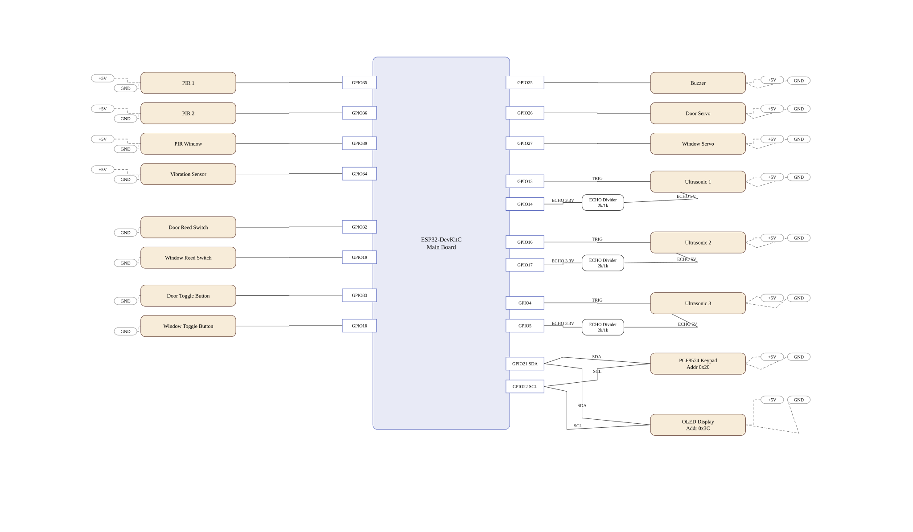

# EmbeddedSecurityHome

An ESP32-based smart home security system running FreeRTOS, integrated with LINE OA for real-time notifications and remote control via MQTT.

This document serves as the Single Source of Truth for:
- Understanding the system scope and logic.
- End-to-end installation and deployment.
- Pre-delivery architectural validation.

---

## 1. Core Features

- **Security Modes:** Supports 3 primary modes: `Disarm`, `Away`, and `Night`.
- **Intrusion Detection:** Monitors events via a sensor array:
  - Reed Switches (Doors / Windows)
  - PIR Motion Sensors
  - Vibration Sensor (Tamper / Forced entry)
  - Ultrasonic Sensors (Round-robin + Timeout execution)
- **Progressive Alert:** Escalating threat logic (`Off -> Warn -> Alert`).
- **Access Control:** 4x4 Keypad PIN flow (`*` = Backspace, `C` = Clear buffer).
- **Local Physical Override:** Dedicated door and window lock/unlock toggle buttons on `GPIO33` and `GPIO18`.
- **Remote Control (LINE/MQTT):**
  - Bubble-based LINE command panel with direct command buttons.
  - Lock/Unlock doors and windows.
  - Mode shifting (`arm_night`, `night_off`).
  - Temporary buzzer `silence` and system `status` requests.
- **State Persistence:** Saves critical states (`latest_mode`, `is_night`) to NVS memory for power-loss recovery.

## 2. System Diagrams

### Architecture


### Runtime Flow


Open interactive Mermaid view:
- [Flowchart in Mermaid Live](https://mermaid.live/edit#pako:eNqtG4ty2kjyV-ZIZQsuNkYiJDa57JYMOGGDgSA5vt31lkpIA-gsJFYSfsTJv1_3zOiJJPBuSKUKj_rdPT09reapZnoWrXVrL18-2a4ddsnTTS1c0TW9qXVvanMjgC9HYumL4dvG3KEBPHvCh-bt0ve2rsVgXyzYh4GvDds9v13urAfU9Fyr6InpbIOQ-kWPqLWkI2NOnfMsQ385N-pyp3MU_W81bmrfI2F7qsqgmmvqgzgWeSKJwF0iGJB_2euN54eGG74j30lwtzwALnl-bHqO55dRayaAQHVhO04pZKwj8akZxtChb7jBxvCpG2YwvI1h2uFjl7Qyy0Hoe7e0S1zPpeUcsgqWscigbA5Hcpinbpd7dagSVkTDYcbAp8exRaRCJi-sM_xX8Oz43rbCFeBtHkqkOGYqkZA-JLK8eMM-1RggrAsYUYwUobAAXzjevbky_JDvq1W4dpjZcZ-F_pYCyL1vbDa2u7xGYWFZlluwatnG0jfWU8Oy4Bksn72BVRd2tIrmYEttXALL3SZLZ63v37-_fHnjxoyJ1r9xCXxMxwiCPl2Qje-ZNAi4ui-otOgs6JGw5ouWfHpqSUcZA8qbh3c5GvQOXcUpQMyfma9jCou52ZKtvRQwW9ih7bkxFdqaywmVzluz1dpLJQiNkAoKlkkt8zSm8Ob0bNE-PUCO9dqAXSykOJ3PrVZMw5Sl0858vzV83_NjPUzLSvSw2vJCXuyl4HjeRkfvRl5hn0QXCf9lqbQ3D9GCZQTgat-APdIhnV0beb6xpCX-ljpvz_Zr-D_PThyFn0rROAFOItjOIZA3KzJVpoPZHzc1clP7kz_Cj2VjIsAw0M4jFPy8fEneH_zJoLWaRP1N1QaXZDgeakNlNPxd0YaT8T-mfT6ZaPU6nnThdlNvEDXE7TWEo9U2HPurgVrc1BoNcnz8M7nuazryB4VjCEo0I7gl10ZoriwPtuuf3W5X7MaETYTJyPS0_-rngw_DMdCBHYOJqjmnS9utN7okRVgxw60Bfg6OyPiLekQwoi8_axpRqX9nm7SEV0yeMQNMfTZQtcls8AfoOfIMiziwv4JQX2No_kTsQHft5Qp2vu-tER70RcIixBLCKVJcj8loNOjBn5FRIHM64HjPj9RhIs9t1-pFT-qNMqkzxBj9wRdN_wxkez7FhMDS0-ct3ZYpzuAZpqaon1S9Nxso2iAhoFKT-ao-9W3Ph9OHyFzCy7_CMPdEKpMzTZrxUgc9XdWUmVYBg16LgDIhq8IWpxb5C7VKG-OyD5rX0aIskTGt_zP3T36uXwwvJhyebV1Anj8mCpiG4-DB3yjzIdpopnHiiUE5accDdG7mgLwiob2m3jaMFjzXedwh-yP2ttREG6LNyKUCUTuaTKb_mG6codA9SBHCIPL_JVS7ZATJmdTl1jpoZHLXbv6KVmNHY76IaA3c0H_EBAFWSfI9-vzDQNO1Ye-TCpxBxbF3T96TNbjMDnY2QdYeSpPM6NqDiBXuT0VGTFXEFWxIpQ9FCCJtYJNxxAG6rN5gbvU5qYXtB-ERsSiPnbXxAKWXubZOQtu8hTocxIlP71wgkuOmQGsmPBOY2eByog30_mQ8qNcJswSeLGmtBA7K_O2mBnF2S07I1sUvN7Vv-PjjtQ68wFR9ZnvMfSBIl2mA6c4jPciUvudAYLKQBYjbE8jW4TbgxozOfLRLSqQyIQLboS7mUMZeHY6Kec-3X79SvwkBj6fDjItUDlrXdGKeXNenA-ZbucQOSsQQUGjVXIt42v4a57qBeux3vv4CYInfR68fw_hHwDkL6VBEWEKqpq_pTFByC-gzAxOU98lLAwh6lN8UW5eZ0bxezXCFE1dODBoU-yIughaBnlExCHJ47nOdyfZGOHqCG4jIQlXcM1ZrlIHRHZ_VbolrcmF4QSJKrPBryAYd8LCsDHVgulZHhR6sArxYOszC-ge3pIFh8nFxRNGQzOy_BhB9hgekHYNPxt8KTY99yUBOdEJxr3xyI2InQILdEnXAo0S95QKkLUXrP9wm4090jdCA7LFlRtsN3gRA5InSPSYE_1WRggz6XmTfKKPGyh5RGmSMWcKkUn0aapPoQoBl8gim3JkTNclHhEoQtqpj9HWOj5DseCR0seMpmw2FHZp6JEpnG7nW7gU-bvxqU0wEKsp_1vQPVd6n4Aw9lfgzmpSUse0f0cho_egoGj8Peo9Qb03woq-51DDx-MNdts_FlwRpC-vWD2Wj1HP8_WV51j6veG7epyZ42CsJn4uiKsTdZf2LfOgvqLORvfxEAvCgwm_IKDeHdTiluAw-VQiPDbl9Og8ew51203Tv1DYMVTKYW5YB5AfWg7blOfamC3nN0WvCRWQu4VSb74NQ89NVRcRCm6Bc74FOOg5h9QrtkKEK6Tog9RQZMFBecXsQjgJFAxyFQL3d1VdM2Y60zj0lkunOApyrK7hggHVVSWz61Jm9wz7Gewi-876ugrJYzLLG7gPBS11A9DfXBl2OuFEGGjfHlZ5kJlmFDIaWqvUsjGaEOAjnBJCNVwtiRgPsk6hOnlyI7Ddt29QoEalBuQQd0mtWMfr4fgJeUTCcnvviJvjcM0voFl5r9mlNyeu8EC1wAm5vfJOpUjc6XBGpH2CTqVdOadSQbx47EoglcsYU9ovopwWUd4rolwgolwqolwhonywiO20iIf5fNoukLNdKme7Qs72oXJ-GZ5Hgn6x577o2FTLCTi7gsLirqR39lwPNvYtLRc1IVYl65Wqq9cgqHpvh-aK1LfB0LXoQ6NCVIYiSPegXiMtTkgSZTt8I5pvL5fUp9YvpP6f96RjrssztMDMVY-g-VVBtJurWylfD4JAw3EPgYX0ACeV9EmyzFilWGUbpJspJyrMIHEcOTaD_EwzyCVmkAvNIBebQc6YQS41g_xMM8iHmkHmOO3YDO1nmqFdYoZ2oRnaxWZoZ8zQKjVD-5lmaJeYAQ_YQRMP-6hXRajLmhOZegj7XL9OhuNsRyJ9oldDqIOxOpntAQJJqwFGk54yKoHJiIuFcXQHicAzAFDcVj6ffKp8jJXlLkC6LchLMgaTts4OyHUBSAYoqizyJswAidO8EoafptUg8n6Q9l4QkcB3YTKejjNUyut5AHkfQHsXoDBsGVg2eoqjtxIwp1AlbEqmQriyoI479YMx9uof2N0fyl-rnrRjjvhGbVT07QGbHGObzWdNxqhNXQBUmhUumkQTLWu8uKTa8RORItv8SiOgRJO0NEFyNJGyBg8buAhbIkVqk90USbETrIumeT5XovRAr9JGAlWvtFVGKEifmSY9StefKcNx_oVEwn6_kSM4AMjQyhr7Q5P0feyjcx1zCTiFmE56KaKfwR2vm-R-BZd9UucWmVGT2nc0ZZRGuXci4ZPmtCCGHUG63oSPzYRZXrLPkVeZ8MadYTs4KMNqyqvRQJ_OJr2Bqpah8f4WY4IoSk_Tr6b9vIk-wgVvCwLx1maqaExxeMJuAO-lcFnqiDJgGOW6pymIXpp-qYyvFLy4i3gsukyz1h9cS4tuvuVdx5h4rlSI1yHlQ1R_NFy4GAvahBPlfeyA9e_xXn7CeyTkFYneQjDgYLeVXs4-bjrCg97VTL-c9AdJXQ23CtFPrSis-0NVmV3q48F_teJzW7lWfqt4PB5--KhVPGf-qXicMhx3XwSfC6E-b94ybdLYkdpRq4WBCZP0deVKm4BBep67sJdNYxt6OlKBiAiZ58rdzHFzblZbvEdNH-xQB08tWae6xTz7008kDjd-YTiQOK8AT8gkXFGf02DJK3FM6hRr5SUaaLqKt5CcVER6x-ON_Rllxvfs1dsrInVaLVGe8gETlowqGcahpkpFNpB2bJBqvJQYQpWKlJELlJF_kDLSjjJtCB6tSKH2jkJQ14NKJ_z2X54iOMmcZj1l3BuMdBCpQLsW6RmuSR2iQHweKxi-2dcDxcqk-cQKZUAzG0i5Nx73bh8EEptHgbIGDKO4hvP4lQoz9MC-Sw_f8pYHNyJG7UFmMoht0Za89HhHQjBQtQF7Fx3SzdWGKA71QzKCE895J94t4qxAF5IY3ejbjW4gQN7RcXoqkyHTUROMeetNpSFnmmXH2Ogr1gx5Jq9c3SO4sQqpklmmUnoGv9Qei3gpl9MB9lTj_g9RsWVDsKBwQ-fxFzE64fkmtfgr-0a1NznJ3QNP0S8ms95gn24LxkmnfDjgMAUzLNOHnKJ_mCk9POOu7XAFVVS7FZAPPr73mVLf9qxfqnVh2LtlLA8KZRZFxbXhu1ld2NsYpsM7Ud3iiyzbXZLoKDlMs7QA-H77jmmWgs7sWfYOdO-mHUevseHR-O_u2nESVWjJNcUZ1nOfGtig6yeJ7wQC62Q6nLUbMUdltC8G-OveOaOWt1RSQJTJI7JIJnmM9eEH9NZw6UIFz0YF7nBWqa46lG4A1qJENRZFb7_TDAvroHwdslMJlQEklMsg4qV0-Z8vlodNEcy2SbYbC19Kp4TgBTao3mmKp_FsXB0OxMbuPATWGmxQBgMDjxgsgXDURUyXmqzfVL5zYvxkZGNJpROZpBIdg5mpWtHxxg_vhWPgZolqsCjn6T4NaLhz4qn8FlEpgkzgeGahYTpewHcyA1TbBWK0oxqCL0fs10FcSMitokLiEEnaaVNgFYOhgmNl8TwDO37fQUjeUZwdxAnunJWy42QH8YY7L_cdO_nV_MWLrzzxY0KF8Aev6k1zRc1bESklDueI6Xthl71R5CaGp3w8id1lpCbeYuqN9LbnTnYERuFNJsOCVb6snTDu61oGCDjxpkH2Cbv14hLOn93h9FmfOsZjNMNWMIJWMJpIUaAfMbUnN7nabG6vnvzUAwqfkXcPeTQapWz8uFk-NkYphvmSmU3pGTN8fMIkGsZEQ8Z0yif5GMJ4gq-QK6f4dpgATkIAYzg18LtGvraISrZLr-0LG39B4bkuzje94vZNLyBOE2Vj8FHjYLINlx6eygyeR-QrxMNmCl-MxkL3Ccz3WVM01IntQgwjZXNtYTeFTQOWokWK9gcj5bdcjEpFMVpAieHujMxmgjfzJQgfHcqn0Isn2TN_ikn21ubhxuX_ake1pW9b4ncbNfHbo1q39oT0k59WwVfL8MF-N-53wNkY7u-et47Q2PhZrbvAou2oxg-oPv-tRwwCIlO_BzskxF-DdDqMSK37VHuodY_fvpWar2XprCW15TeSJL8-qj3CstyWOs3WG7jrvW53Xrfab-XvR7WvjHGn2XlzdvrmtCO1T1tnb77_H5aGcko)

### Wiring References
- 
- 
- 

## 3. Runtime Contract

- **RTOS Execution:** `SecTask` runs at `20 ms` and `MqttTask` runs at `10 ms`.
- **Event Management:** Handled via `eventQueue`, `commandQueue`, and `publishQueue`.
- **Input Order:** `SecTask` polls keypad first, then local lock/unlock toggle buttons, then the sensor chain.
- **Serial Monitor Policy:** Serial is debug-only in this build and no longer injects security events.
- **Network Task:** MQTT reconnect and publish handling run in a dedicated low-priority `MqttTask`.
- **Remote Security Policy:**
  - `arm_night` is only permitted when `latest_mode == Disarm`.
  - `night_off` is only permitted when currently in `Night` mode (reverts to the previous `latest_mode`).

---

## 4. Setup & Installation (Windows, UI-First)

Primary path for this project is the **UI Launcher**.  
Use CMD/Terminal only as a secondary fallback for troubleshooting or automation.

### 4.1 Prerequisites
- Python 3.10+
- Git
- MQTT Broker (Mosquitto recommended)
- ESP32 USB Drivers (CP210x / CH340)
- LINE Developers Account (Messaging API)
- ngrok Account + Authtoken

### 4.2 Get ngrok Authtoken (One-time)
1. Sign up / sign in at [ngrok dashboard](https://dashboard.ngrok.com/).
2. Open **Your Authtoken** page: [https://dashboard.ngrok.com/get-started/your-authtoken](https://dashboard.ngrok.com/get-started/your-authtoken).
3. Click **Copy** to copy your token.
4. Paste token into Launcher **Config** tab field `NGROK_AUTHTOKEN`, then **Save to .env**.
5. (Optional, machine-level) Run once in terminal:
```bat
ngrok config add-authtoken <YOUR_NGROK_AUTHTOKEN>
```

### 4.3 First-time Setup
Open Command Prompt at the project root and run once:
```bat
setup.cmd
```

### 4.4 Launch Control Center (Primary Path)
Open the system management UI:
```bat
tools\line_bridge\start-ui.cmd
```
*(Alternatively, double-click `tools/line_bridge/launcher.vbs`)*

### 4.5 System Configuration
In the Launcher window:
1. **Config Tab:**
   - Enter your `LINE_CHANNEL_ACCESS_TOKEN` and `LINE_CHANNEL_SECRET`.
   - Enter your `NGROK_AUTHTOKEN`.
2. **Firmware Tab:**
   - Enter Wi-Fi credentials (SSID / Password).
   - Enter MQTT Broker details (IP / Port / Username / Password).
   - Set the `FW_DOOR_CODE` (4-digit Keypad PIN).
   - Click **Save to .env**.

### 4.6 Start Bridge + Webhook (from UI)
1. Go to the **Status** tab.
2. Click **Start**.
3. Wait until ngrok URL appears, then click **Copy Webhook**.
4. Use that URL in LINE Developers (steps in Section 5).

### 4.7 Deploy Firmware (from UI)
1. Connect the ESP32 board via USB.
2. In the Firmware tab, click **Refresh Ports** and select the correct COM port.
3. Click **Deploy Main Board** to compile and flash the firmware.

### 4.8 Secondary Path (CMD/Terminal Fallback)
Use this only when UI cannot be used.

Firmware build/upload:
```powershell
pio run -e main-board
pio run -e main-board -t upload
pio device monitor -b 115200
```

Bridge runtime (manual):
```bat
cd tools\line_bridge
run.cmd
```

---

## 5. Webhook Integration (LINE OA)

### 5.1 Recommended: Configure via UI
1. In Launcher **Status** tab, click **Start**.
2. Wait for ngrok URL, then click **Copy Webhook**.
3. Go to [LINE Developers Console](https://developers.line.biz/) > your channel > **Messaging API**.
4. Paste URL ending with `/line/webhook`.
5. Click **Verify** and enable **Use webhook**.

### 5.2 Secondary: Manual (outside UI)
1. Set ngrok token once on your machine:
```bat
ngrok config add-authtoken <YOUR_NGROK_AUTHTOKEN>
```
2. Ensure `tools\line_bridge\.env` has:
   - `LINE_CHANNEL_ACCESS_TOKEN`
   - `LINE_CHANNEL_SECRET`
   - `HTTP_PORT=8080` (or your chosen port)
3. Start bridge + tunnel:
```bat
cd tools\line_bridge
run.cmd
```
4. Open ngrok inspector `http://127.0.0.1:4040`, copy HTTPS URL, then append `/line/webhook`.
5. In LINE Developers > **Messaging API**:
   - Paste webhook URL
   - Press **Verify**
   - Turn on **Use webhook**

---

## 6. Command Reference

LINE chat uses a single bubble command panel. Send `menu` to open the command bubble again.

| Command | Effect |
|---|---|
| `lock door` / `unlock door` | Actuate the main door lock |
| `lock window` / `unlock window` | Actuate the window lock |
| `lock all` / `unlock all` | Actuate all locks simultaneously |
| `arm night` / `arm_night` | Enter Night mode (perimeter monitoring only) |
| `night_off` | Exit Night mode and revert to the previous mode |
| `silence` | Temporarily mute the buzzer (alert state remains active) |
| `status` | Request a snapshot of the current system state |

## 7. MQTT Topics (Contract)

- `esh/main/cmd` (ESP32 Subscribe - Receives commands)
- `esh/main/event` (ESP32 Publish - Emits hardware/security events)
- `esh/main/status` (ESP32 Publish - Emits state snapshots)
- `esh/main/ack` (ESP32 Publish - Acknowledges command execution)
- `esh/main/metrics` (ESP32 Publish - Emits system health/performance data)

## 8. Project Structure

- `src/main_board/*` : Source code for the primary ESP32 firmware.
- `tools/line_bridge/*` : Source code for the LINE Bridge and UI Launcher.
- `docs/*` : Documentation hub (Block Diagram, Flowchart, Pin Allocation).

---

## 9. Possible Cases & Expected Behaviors

This README keeps the high-level summary. The complete case list lives in `docs/possiblecase.md`.

### Category 1: Mode Transitions & Automation
- **Auto-Arm Success:** `chk1 -> door open -> door close -> 20s no indoor activity` moves the system from `Disarm` to `Away`, persists mode state, and locks actuators.
- **Auto-Arm Cancel:** Indoor/window activity during `exit_stage == 3` cancels the auto-arm countdown.
- **Auto-Arm Stage Timeout Reset:** If stage `1` or `2` stalls for `15s`, the partial sequence is discarded.
- **Door Session Auto-Lock:** Door unlock sessions can end with `auto_locked` after close or `auto_locked_timeout` if the door never opens.

### Category 2: Away Mode Intrusions
- **Authorized Entry:** Door open without recent vibration starts `warn_entry` and a `30s` keypad deadline.
- **Forced Entry:** Recent `vib_spike`, `door_tamper`, or door open while locked escalates directly to alert.
- **Step-Up Alert:** Indoor motion/chokepoint activity steps risk upward from `Off -> Warn -> Alert`.

### Category 3: Night Mode Security
- **Perimeter Breach:** `door_open`, `window_open`, `vib_spike`, or `motion 3` raises `alert_night_breach`.
- **Indoor Activity Ignored:** `motion 1`, `motion 2`, `chk1`, `chk2`, and `chk3` are ignored in `Night`.

### Category 4: Keypad & Local Physical Control
- **Valid PIN:** Correct keypad entry disarms the system, clears `is_night`, unlocks the door, and resets failed attempts.
- **Wrong PIN / Brute Force:** Attempts `1-2` publish `wrong_code`; attempt `3+` publishes `keypad_alert`.
- **Local Lock/Unlock Toggle Buttons:** Physical buttons on `GPIO33` and `GPIO18` toggle door/window locks and publish manual status reasons.

### Category 5: Remote Control & Connectivity
- **Remote Arm Night:** Allowed only when `latest_mode == Disarm`.
- **Remote Night Off:** Allowed only while current mode is `Night`.
- **Utility Commands:** `lock/unlock`, `silence`, and `status` execute immediately and publish ack/status.
- **Reconnect Policy:** `MqttTask` handles reconnect in the background so the `SecTask` loop stays responsive.

---


