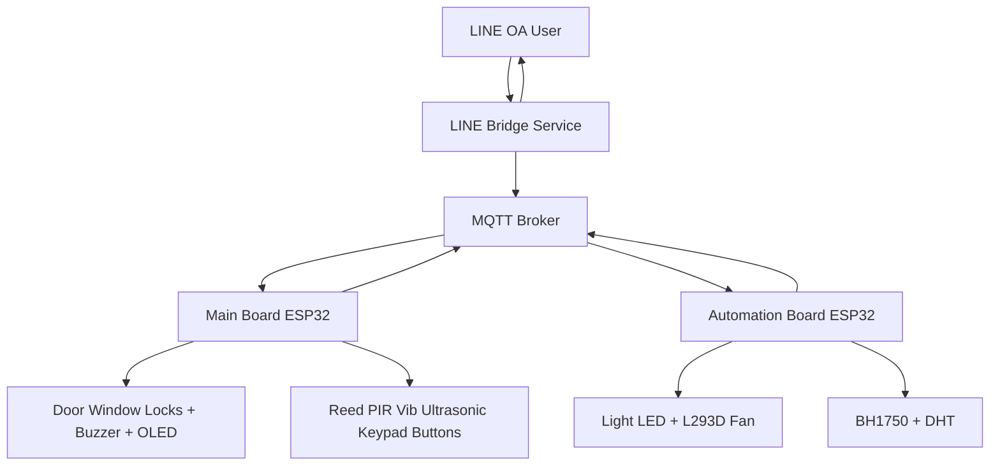
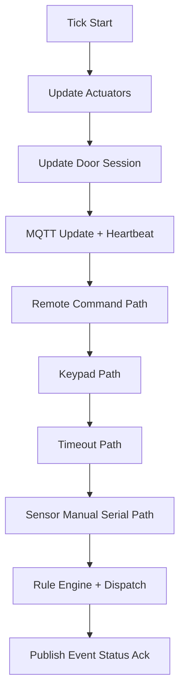
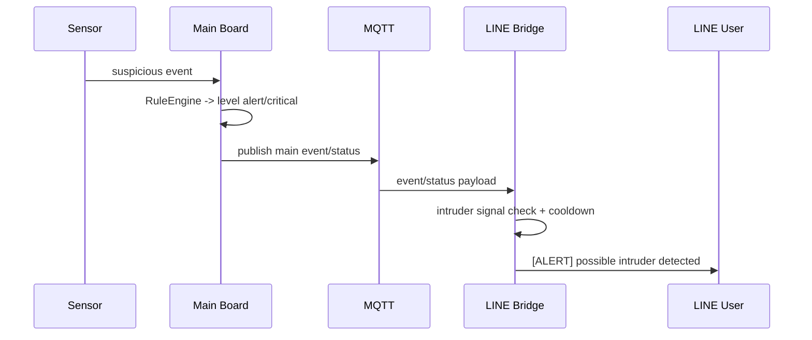
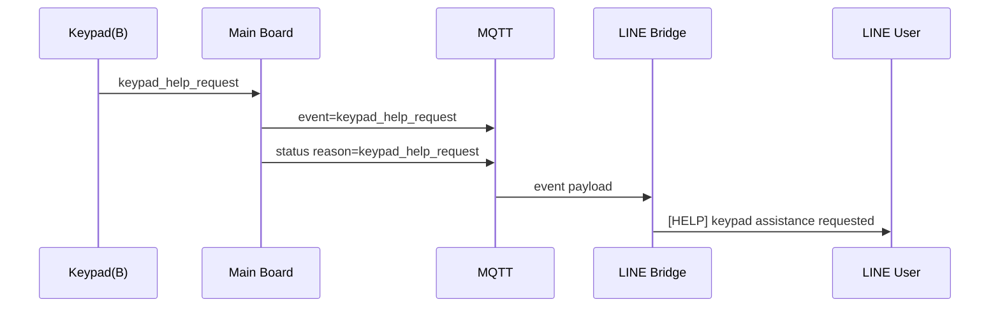

# Architectural Design (Actual Update, Not Finalized)

Status: draft as-built architecture snapshot
Last updated: 2026-02-19

## 1) Scope

This document reflects the current implemented architecture, not a final frozen design.
It describes:
- component boundaries
- communication contracts
- runtime execution model
- latest architectural updates in security notification paths

## 2) System Context (Current)

## 3) Component Architecture

### 3.1 Main Board (Security-Critical Core)

Layers:
- `app/`
  - orchestration and domain rules
  - state and command decision
- `pipelines/`
  - event collection, timeout scheduling, gate checks
- `services/`
  - MQTT bus/client, notify, logger, command dispatcher
- `sensors/`, `drivers/`, `actuators/`, `ui/`, `rtos/`
  - hardware and infrastructure adapters

Key responsibilities:
- accept events from physical sensors, keypad, serial, MQTT commands
- derive security state (`mode`, `level`, `suspicion_score`, `entry_pending`)
- enforce lock/unlock and alarm policy
- publish state and telemetry

### 3.2 Automation Board (Home Automation Core)

Layers:
- `app/AutomationRuntime.cpp`
  - runtime orchestration, MQTT callbacks, task loops
- `automation/`
  - policy modules (`light_system`, `temp_system`, `presence`)
- `hardware/AutoHardwareConfig.h`
  - pins/thresholds/timing

Key responsibilities:
- parse main-board context (`mode`, `isSomeoneHome`)
- run light/fan hysteresis logic
- apply output states and publish auto status/ack

### 3.3 LINE Bridge (Integration Edge)

Runtime:
- FastAPI webhook + HTTP command endpoint
- MQTT client loop thread
- LINE push/reply via Messaging API

Key responsibilities:
- validate/normalize incoming commands
- encode secure command payloads to firmware
- transform MQTT events/status into human-readable LINE notifications
- maintain anti-spam/cooldown behavior for high-frequency notifications

## 4) Communication Contracts

### 4.1 MQTT Topics (Current)

Main board:
- `esh/main/cmd` (inbound)
- `esh/main/event` (outbound)
- `esh/main/status` (outbound)
- `esh/main/ack` (outbound)
- `esh/main/metrics` (outbound)

Automation board:
- `esh/auto/cmd` (inbound)
- `esh/auto/status` (outbound)
- `esh/auto/ack` (outbound)

### 4.2 Command Security Contract

- mutating command payload format: `token|nonce|cmd`
- replay guard with nonce TTL cache
- optional monotonic nonce floor persistence
- fail-closed behavior when required token/nonce prerequisites are unavailable

## 5) Runtime and Control Flow

### 5.1 Main Board Tick Pipeline

### 5.2 Automation Runtime

- `taskNet`
  - reconnect Wi-Fi/MQTT
  - dispatch MQTT callback
  - periodic auto status publish
- `taskControl`
  - sample lux/temp on cadence
  - apply main-context gates
  - compute hysteresis decisions and apply outputs

## 6) Latest Architectural Updates (Actual)

### 6.1 Intruder-Focused LINE Alert Layer

Added in bridge:
- explicit intruder alert formatting (`[ALERT] possible intruder detected`)
- trigger policy:
  - `level` in `alert|critical`
  - event/reason in intrusion trigger set
- cooldown control via `INTRUDER_NOTIFY_COOLDOWN_S`

Architectural effect:
- bridge now has a semantic alert layer above generic event/status formatting
- notification path split into:
  - critical semantic alert path
  - generic telemetry path

### 6.2 Keypad Help Request Path

Added in main board:
- keypad key `B` -> `keypad_help_request` event
- serial test key `H`/`h` -> same event for synthetic validation
- orchestrator publishes event/status reason and notify message

Added in bridge:
- dedicated help text push:
  - `[HELP] keypad assistance requested`

Architectural effect:
- new human-assistance signal channel independent of intrusion rule escalation

## 7) Sequence Snapshots

### 7.1 Intruder Alert Sequence

### 7.2 Keypad Help Sequence

## 8) Known Design Gaps (Expected in Draft Stage)

- no finalized SLA for push latency and recovery under broker/network partition
- no finalized production incident policy for repeated alert escalation tiers
- limited automated test coverage for new semantic alert formatting branches
- hardware-in-loop test matrix not fully automated yet

## 9) Finalization Candidates

Before declaring architecture final:
- formalize notification policy spec (trigger, cooldown, dedup behavior)
- lock keypad UX spec for emergency/help actions
- complete end-to-end resilience tests (MQTT reconnect, bridge restart, duplicate event bursts)
- publish architecture version tag and compatibility matrix

