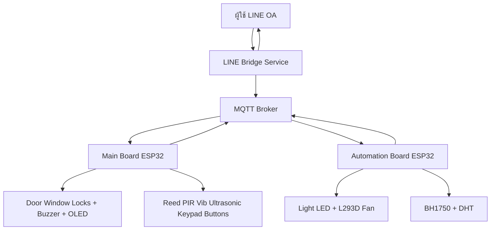
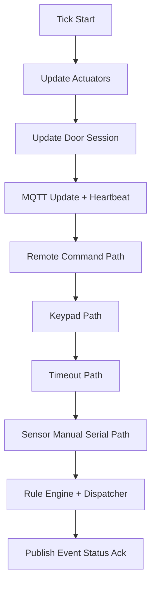
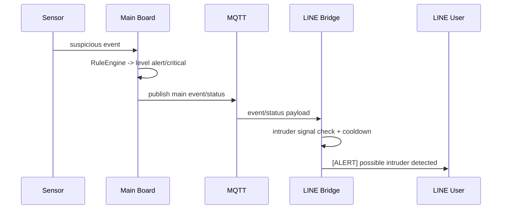
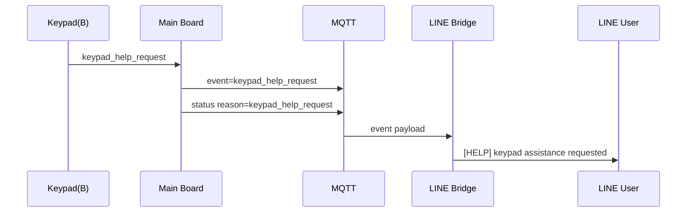

# แบบออกแบบสถาปัตยกรรม (อัปเดตตามของจริง ยังไม่ finalized)

สถานะ: Draft อ้างอิง implementation ปัจจุบัน
อัปเดตล่าสุด: 2026-02-19

## 1) ขอบเขตเอกสาร

เอกสารนี้สะท้อนสถาปัตยกรรมที่ “มีอยู่จริงในโค้ดตอนนี้” ไม่ใช่ baseline สุดท้าย
ครอบคลุม:
- ขอบเขต component
- สัญญาการสื่อสาร (communication contracts)
- runtime execution model
- อัปเดตล่าสุดด้าน notification

## 2) ภาพรวมระบบ (Current)

## 3) สถาปัตยกรรมเชิงองค์ประกอบ

### 3.1 Main Board (แกนความปลอดภัย)

ชั้นหลัก:
- `app/`: orchestration + rule/state
- `pipelines/`: event collection + scheduling + gate
- `services/`: mqtt bus/client, dispatcher, notify, logger
- `sensors/drivers/actuators/ui/rtos/`: infra และ hardware adapter

หน้าที่หลัก:
- รับ event จาก sensor/keypad/serial/remote
- ประเมิน state ความปลอดภัย (`mode`, `level`, `suspicion`, `entry_pending`)
- บังคับ policy lock/unlock/alarm
- publish MQTT event/status/ack/metrics

### 3.2 Automation Board (แกน automation)

ชั้นหลัก:
- `app/AutomationRuntime.cpp`: runtime orchestration + task loops + MQTT callback
- `automation/`: policy modules (`light_system`, `temp_system`, `presence`)
- `hardware/AutoHardwareConfig.h`: pin/threshold/time constants

หน้าที่หลัก:
- รับ context จาก Main (`mode`, `isSomeoneHome`)
- ตัดสินใจไฟ/พัดลมแบบ hysteresis + gating
- publish auto status/ack

### 3.3 LINE Bridge (integration edge)

runtime:
- FastAPI webhook + HTTP cmd endpoint
- MQTT loop thread
- LINE Messaging API push/reply

หน้าที่หลัก:
- รับคำสั่งจาก LINE และส่งเข้า MQTT command topic
- แปลง MQTT payload เป็นข้อความที่อ่านง่าย
- ทำ cooldown ลดการแจ้งเตือนซ้ำถี่

## 4) Communication Contracts

### 4.1 MQTT Topics

Main board:
- `esh/main/cmd` (in)
- `esh/main/event` (out)
- `esh/main/status` (out)
- `esh/main/ack` (out)
- `esh/main/metrics` (out)

Automation board:
- `esh/auto/cmd` (in)
- `esh/auto/status` (out)
- `esh/auto/ack` (out)

### 4.2 Security Contract (Remote Command)

- format: `token|nonce|cmd`
- anti-replay: nonce TTL + monotonic floor
- fail-closed เมื่อ auth prerequisite ไม่พร้อม

## 5) Runtime และ Control Flow

### 5.1 Main Board Tick Pipeline

### 5.2 Automation Runtime

- `taskNet`: Wi-Fi/MQTT reconnect + callback + periodic status
- `taskControl`: sample sensor + main-context gate + hysteresis + apply output

## 6) อัปเดตสถาปัตย์ล่าสุด (Actual Update)

### 6.1 Intruder Alert Semantic Layer (Bridge)

เพิ่มชั้นแจ้งเตือนเชิงความหมายใน Bridge:
- ส่งข้อความเฉพาะ `[ALERT] possible intruder detected`
- trigger:
  - `level` เป็น `alert` หรือ `critical`
  - event/reason อยู่ในกลุ่ม intrusion trigger
- cooldown ผ่าน `INTRUDER_NOTIFY_COOLDOWN_S`

ผลด้านสถาปัตย์:
- เส้นแจ้งเตือนถูกแยกเป็น
  - semantic critical alert path
  - generic telemetry path

### 6.2 Keypad Help Request Path

เพิ่มเส้นทางขอความช่วยเหลือ:
- keypad ปุ่ม `B` -> `keypad_help_request`
- serial `H/h` -> synthetic test path เดียวกัน
- main publish event/status reason ที่เกี่ยวข้อง
- bridge push `[HELP] keypad assistance requested`

ผลด้านสถาปัตย์:
- มี human-assistance channel แยกจาก intrusion escalation

## 7) Sequence Snapshot

### 7.1 Intruder Alert Sequence

### 7.2 Keypad Help Sequence

## 8) ประเด็นที่ยังไม่ final (ตามธรรมชาติของ draft)

- ยังไม่มี SLA สุดท้ายเรื่อง latency/recovery ระหว่าง network partition
- policy แจ้งเตือนซ้ำระดับ incident ยังต้องจูนหน้างานจริง
- test coverage อัตโนมัติของ branch ใหม่ (semantic alerts) ยังเพิ่มได้อีก
- hardware-in-loop matrix ยังไม่ครบอัตโนมัติ

## 9) ทางไปสู่เวอร์ชัน finalized

- freeze policy ของ trigger/cooldown/dedup
- lock UX ของ keypad help (ข้อความ/สถานะ/OLED)
- เพิ่ม resilience test สำหรับ broker disconnect/reconnect/restart
- version architecture baseline และ compatibility matrix

