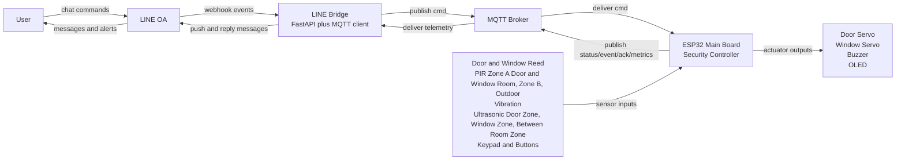
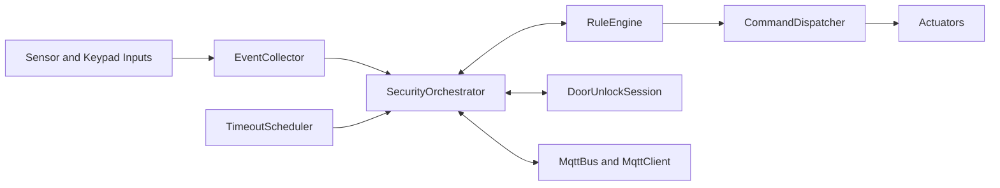
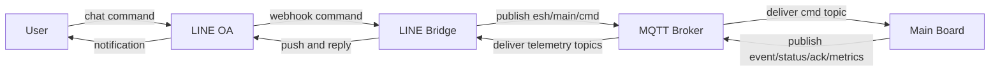

# Block Diagram (Single-Board)

## 1) System-Level Block Diagram

```mermaid
flowchart LR
  U[User]
  LINE[LINE OA]
  BRIDGE[LINE Bridge\nFastAPI plus MQTT client]
  MQTT[MQTT Broker]
  MAIN[ESP32 Main Board\nSecurity Controller]

  SENSORS[Door and Window Reed\nPIR Zone A Door and Window Room, Zone B, Outdoor\nVibration\nUltrasonic Door Zone, Window Zone, Between Room Zone\nKeypad and Buttons]
  ACT[Door Servo\nWindow Servo\nBuzzer\nOLED]

  U -->|chat commands| LINE
  LINE -->|messages and alerts| U
  LINE -->|webhook events| BRIDGE
  BRIDGE -->|push and reply messages| LINE
  BRIDGE -->|publish cmd| MQTT
  MQTT -->|deliver telemetry| BRIDGE
  MAIN -->|publish status/event/ack/metrics| MQTT
  MQTT -->|deliver cmd| MAIN
  SENSORS -->|sensor inputs| MAIN
  MAIN -->|actuator outputs| ACT
```

## 2) Main-Board Internal Block Diagram

```mermaid
flowchart LR
  IN[Sensor and Keypad Inputs]
  EC[EventCollector]
  ORCH[SecurityOrchestrator]
  RE[RuleEngine]
  DUS[DoorUnlockSession]
  TS[TimeoutScheduler]
  CD[CommandDispatcher]
  OUT[Actuators]
  BUS[MqttBus and MqttClient]

  IN --> EC --> ORCH
  TS --> ORCH
  ORCH <--> RE
  ORCH <--> DUS
  RE --> CD --> OUT
  ORCH <--> BUS
```

## 3) External Interface Block

```mermaid
flowchart LR
  USER[User]
  LINE[LINE OA]
  MQTT[MQTT Broker]
  MAIN[Main Board]
  BRIDGE[LINE Bridge]

  USER -->|chat command| LINE
  LINE -->|webhook command| BRIDGE
  BRIDGE -->|publish esh/main/cmd| MQTT
  MQTT -->|deliver cmd topic| MAIN
  MAIN -->|publish event/status/ack/metrics| MQTT
  MQTT -->|deliver telemetry topics| BRIDGE
  BRIDGE -->|push and reply| LINE
  LINE -->|notification| USER
```
