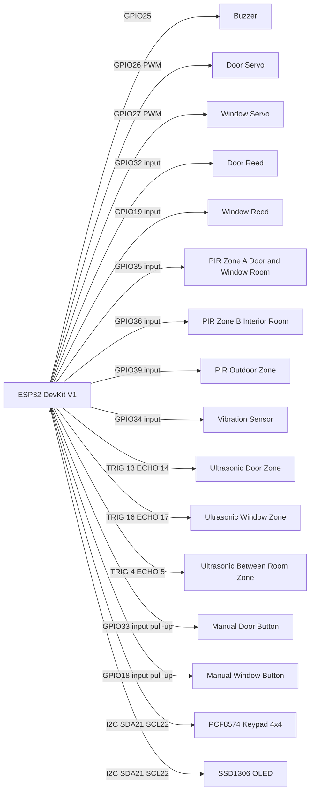

# Circuit (Single-Board Main Firmware)

## 1) Wiring Diagram (Logical)

## 2) Pin Map

| Module | Signal | ESP32 Pin | Notes |
|---|---|---|---|
| Buzzer | PWM | GPIO25 | LEDC tone output |
| Door servo | PWM | GPIO26 | 50Hz servo PWM |
| Window servo | PWM | GPIO27 | 50Hz servo PWM |
| Door reed | Digital in | GPIO32 | Event: `door_open` |
| Window reed | Digital in | GPIO19 | Event: `window_open` |
| PIR Zone A | Digital in | GPIO35 | Room that contains door and window |
| PIR Zone B | Digital in | GPIO36 | Other indoor room |
| PIR Outdoor Zone | Digital in | GPIO39 | Outdoor zone |
| Vibration | Digital in | GPIO34 | Event: `vib_spike` |
| Ultrasonic Door Zone | TRIG / ECHO | GPIO13 / GPIO14 | Chokepoint at main entry door |
| Ultrasonic Window Zone | TRIG / ECHO | GPIO16 / GPIO17 | Chokepoint at window side |
| Ultrasonic Between Room Zone | TRIG / ECHO | GPIO4 / GPIO5 | Chokepoint between rooms |
| Manual door button | Digital in | GPIO33 | Active LOW with pull-up |
| Manual window button | Digital in | GPIO18 | Active LOW with pull-up |
| Keypad (PCF8574) | I2C SDA/SCL | GPIO21 / GPIO22 | I2C addr `0x20` |
| OLED SSD1306 | I2C SDA/SCL | GPIO21 / GPIO22 | I2C addr `0x3C` |

## 3) Electrical Notes

- Use external 5V supply for servos and share GND with ESP32.
- If ultrasonic modules are 5V (for example HC-SR04), protect ESP32 ECHO pins with level shifting or resistor divider to 3.3V-safe input.
- GPIO34/35/36/39 are input-only pins and suitable for sensor inputs.
- Buttons are configured as `INPUT_PULLUP`, so wiring should short to GND when pressed.

## 4) Sensor Position Mapping (for report/demo)

| Sensor Name | Position Definition |
|---|---|
| Ultrasonic Door Zone | Main entry door chokepoint |
| Ultrasonic Window Zone | Window-side chokepoint |
| Ultrasonic Between Room Zone | Between-room chokepoint |
| PIR Zone A | Room that has both door and window |
| PIR Zone B | Other indoor room |
| PIR Outdoor Zone | Outdoor perimeter side |
