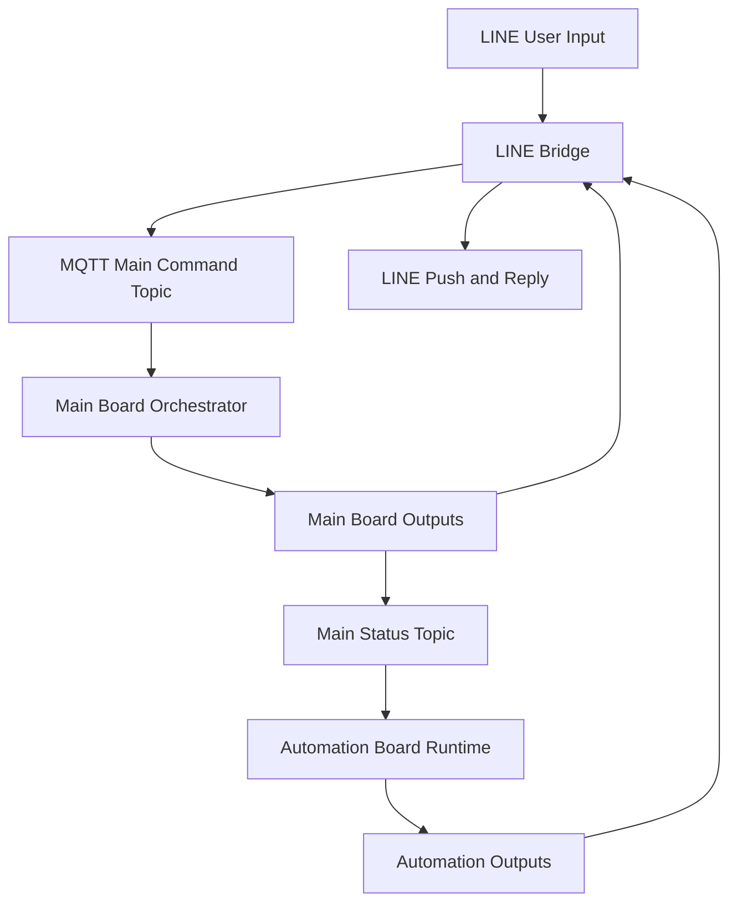
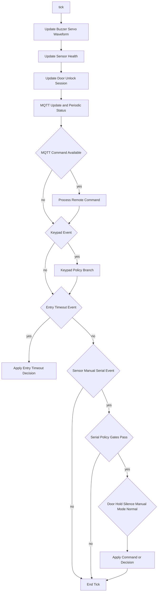
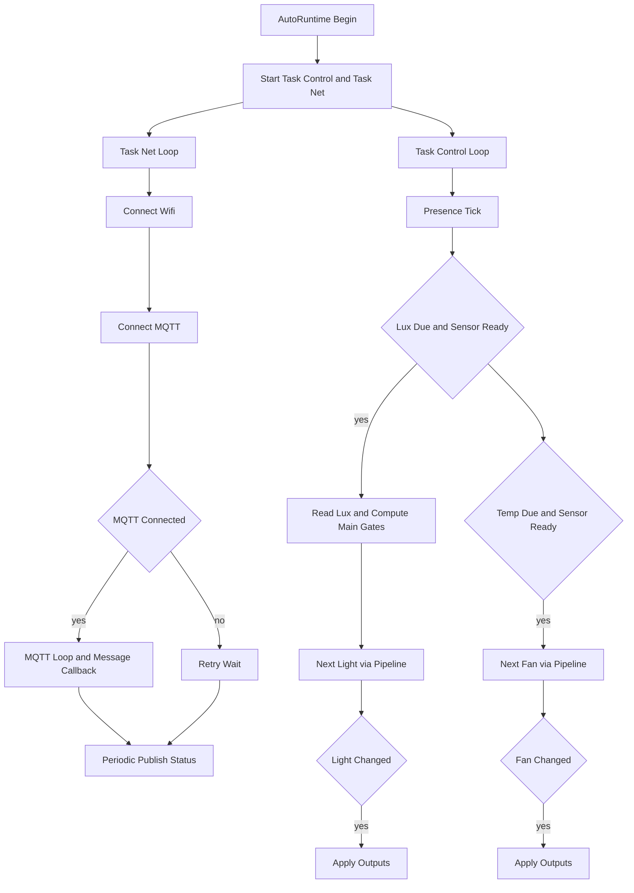
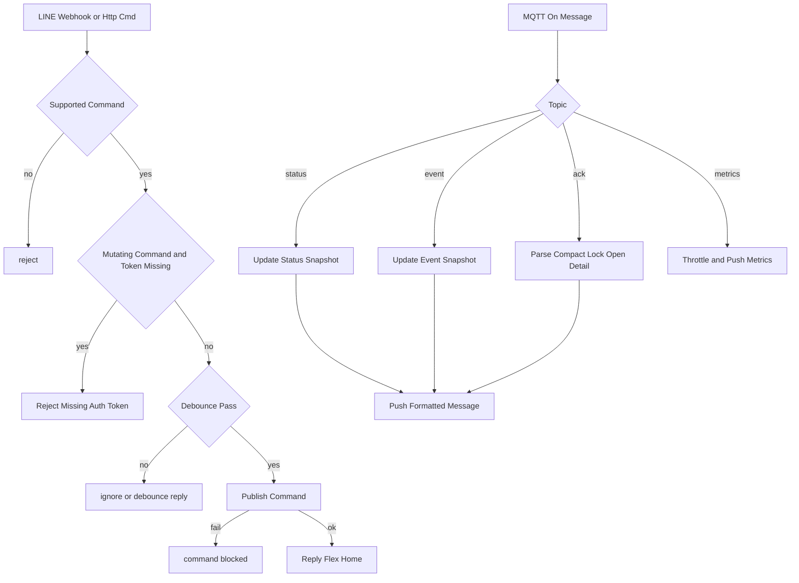

# Full IO Process Condition Matrix (Exhaustive)

This document maps the project logic into explicit `Input -> Process -> Condition -> Output` cases.
Scope includes:
- Main board firmware (`src/main_board/*`)
- Automation board firmware (`src/auto_board/*`)
- LINE bridge and launcher/runtime scripts (`tools/line_bridge/*`, `setup.*`, `tools/linux_ui/*`)

Date analyzed: 2026-02-18

## 1. System-Level Dataflow

Key references:
- `src/main_board/app/SecurityOrchestrator.cpp:670`
- `src/auto_board/app/AutomationRuntime.cpp:647`
- `tools/line_bridge/bridge.py:562`

## 2. Main Board: Complete IO/Condition Matrix

### 2.1 Inputs and First Processing Entry

| Input Source | Raw Input | First Process Function | Core Conditions | Immediate Output |
|---|---|---|---|---|
| MQTT command topic | string payload from `MQTT_TOPIC_CMD` | `SecurityOrchestrator::processRemoteCommand` | auth/token/nonce/replay checks | ack/status and possibly actuator/mode change |
| Keypad I2C | single key char | `EventCollector::pollKeypad` | keypad debounce, submit key `#`, special key `A` | keypad event (`door_code_unlock`, `door_code_bad`, `door_hold_warn_silence`, mode events) |
| Manual door button | GPIO LOW press | `EventCollector::pollManualButtons` | debounce window stable | `manual_door_toggle` event |
| Manual window button | GPIO LOW press | `EventCollector::pollManualButtons` | debounce window stable | `manual_window_toggle` event |
| Door reed | state change open/close | `ReedSensor::poll` | debounce + first-open-only until close | `door_open` event |
| Window reed | state change open/close | `ReedSensor::poll` | debounce + first-open-only until close | `window_open` event |
| PIR1/PIR2/PIR3 | digital high edge | `PirSensor::poll` | rising-edge + cooldown | `motion` event (src=1/2/3) |
| Vibration combined | digital high edge | `VibrationSensor::poll` | rising-edge + cooldown | `vib_spike` event |
| Ultrasonic chokepoint 1/2/3 | distance cm | `ChokepointSensor::poll` | sample-period + hysteresis + cooldown | `chokepoint` event |
| Serial synthetic command | first char token | `EventCollector::readSerialEvent` | char mapped in parser | synthetic event (src=250) |
| Entry deadline timeout | no raw external input | `TimeoutScheduler::pollEntryTimeout` | `entry_pending` and deadline reached | `entry_timeout` event |

References:
- `src/main_board/pipelines/EventCollector.cpp:151`
- `src/main_board/sensors/ReedSensor.cpp:31`
- `src/main_board/sensors/PirSensor.cpp:25`
- `src/main_board/sensors/VibrationSensor.cpp:26`
- `src/main_board/sensors/ChokepointSensor.cpp:39`
- `src/main_board/pipelines/TimeoutScheduler.cpp:3`

### 2.2 Tick Pipeline (Exact Order)

| Order | Process Step | Condition | Output/Effect |
|---|---|---|---|
| 1 | update actuator waveforms | always | buzzer/servo PWM progression |
| 2 | auto-start door unlock session if lock transitioned locked->unlocked while door closed | `!doorSession active && wasLocked && !lockedNow && !doorOpen` | start unlock countdown |
| 3 | sensor health check | periodic by `sensor_health_check_period_ms` | fault state update, notify/status, buzzer warn in armed mode |
| 4 | door unlock session update | if session active | relock timeout, hold warning beeps, close-relock |
| 5 | keypad lockout expiration check | if lockout deadline reached | notify + status |
| 6 | OLED status update with countdown | always | local UI update |
| 7 | MQTT bus update and periodic heartbeat status | heartbeat period elapsed | publish status `periodic` |
| 8 | process one queued remote command | if mqtt cmd exists | remote command path |
| 9 | process one keypad event | if available | keypad policy path |
| 10 | process timeout event | if available | rule engine path |
| 11 | process one sensor/manual/serial event | if available | policy-gated serial/manual/mode/rule path |

Reference: `src/main_board/app/SecurityOrchestrator.cpp:670`

### 2.3 Remote Command Parser and Decision Matrix

Common pre-gates for all non-readonly commands:
- Token required unless `allow_remote_without_token` is true and command is `status`.
- Nonce required if token configured and `require_remote_nonce` true.
- Replay guard required if nonce required.
- Monotonic nonce floor required if `require_remote_monotonic_nonce` true.
- Mutating commands blocked if monotonic persistence unavailable and fail-closed enabled.

Reference:
- `src/main_board/app/SecurityOrchestrator.cpp:335`
- `src/main_board/app/SecurityOrchestrator.cpp:359`

| Command Text (normalized) | Conditions | Process | Output |
|---|---|---|---|
| `status` | auth pass (or allowed without token in fail-closed check) | compose status summary | notify text + ack success + status `remote_status` |
| `buzz`, `buzzer`, `buzz warn`, `buzzer warn` | auth/replay pass | `buzzer.warn()` | ack success + status `remote_buzz_warn` |
| `alarm`, `alarm on`, `buzz alarm`, `buzz alert`, `buzzer alert` | auth/replay pass | `buzzer.alert()` | ack success + status `remote_alarm` |
| `silence`, `alarm off`, `buzz stop`, `buzzer stop` | auth/replay pass | `buzzer.stop()` | ack success + status `remote_silence` |
| `disarm`, `mode disarm` | auth/replay pass | mode event path | mode state update + ack success |
| `arm night`, `arm_night`, `mode night` | auth/replay pass | mode event path | mode state update + ack success |
| `arm away`, `arm_away`, `mode away` | auth/replay pass | mode event path | mode state update + ack success |
| `lock door` | door must be closed | servo1 lock, clear door session | ack success/fail + status |
| `lock window` | window must be closed | servo2 lock, set `keep_window_locked_when_disarmed=true` | ack success/fail + status |
| `lock all` | door and window both closed | lock both, clear session, keep-window-lock=true | ack success/fail + status |
| `unlock door` | if sensor fault fail-closed disabled or no fault, and mode is disarm | unlock door + start door session | ack success/fail + status |
| `unlock window` | same unlock policy as above | unlock window + keep-window-lock=false | ack success/fail + status |
| `unlock all` | same unlock policy as above | unlock both + start door session + keep-window-lock=false | ack success/fail + status |
| unknown text | n/a | unsupported branch | ack `unknown=false` + status `remote_unknown` |

Reference:
- `src/main_board/app/SecurityOrchestrator.cpp:365`
- `src/main_board/app/SecurityOrchestrator.cpp:545`
### 2.4 Keypad Input Cases

#### 2.4.1 Raw Key Mapping (`I2CKeypadDriver` + `KeypadInput`)

| Raw Key | Condition | Output Event / Action |
|---|---|---|
| `A` | direct special in collector | `door_hold_warn_silence` event |
| `0-9` | within input length < 4 | append digit buffer |
| `*` or `D` | if buffer non-empty | backspace |
| `C` | always | clear code buffer |
| `#` with len==4 and code match | submit | `door_code_unlock` |
| `#` otherwise | submit | `door_code_bad` |

Reference:
- `src/main_board/pipelines/EventCollector.cpp:89`
- `src/main_board/sensors/KeypadInput.cpp:36`

#### 2.4.2 Orchestrator Keypad Event Handling

| Keypad Event | Conditions | Process | Output |
|---|---|---|---|
| `door_hold_warn_silence` | active session + door open + hold warn active | silence hold warning | buzzer stop + notify if accepted |
| `door_code_bad` | if keypad lockout active | immediate reject | ack fail + status reject-lockout |
| `door_code_bad` | if not lockout | increment bad attempts | notify count, ack fail; if limit reached: alert buzzer + enable lockout + status |
| `door_code_unlock` | if lockout active | reject | ack fail + status reject-lockout |
| `door_code_unlock` | if sensor fault and fail-closed | force disarm if needed, keep door locked | notify + ack fail + status reject-sensor-fault |
| `door_code_unlock` | valid unlock path | disarm if needed, unlock door, lock window, start door session | notify accepted |
| mode events | `disarm`, `arm_night`, `arm_away` | processModeEvent | applyDecision + status/event |
| keypad event allowed by EventGate | currently only mode events | applyDecision | standard rule output |
| other keypad command | blocked | serial print only | no state mutation |

Reference:
- `src/main_board/app/SecurityOrchestrator.cpp:738`
- `src/main_board/pipelines/EventGate.cpp:3`

### 2.5 Serial Synthetic Event Cases

#### 2.5.1 Character to Event Mapping

| Char | Event |
|---|---|
| `0` | `disarm` |
| `1` | `arm_night` |
| `6` | `arm_away` |
| `8` | `door_open` |
| `2` | `window_open` |
| `7` | `door_tamper` |
| `3` | `vib_spike` |
| `4` | `motion` |
| `5` | `chokepoint` |
| `S`/`s` | `door_hold_warn_silence` |
| `D`/`d` | `manual_door_toggle` |
| `W`/`w` | `manual_window_toggle` |
| `L`/`l` | `manual_lock_request` |
| `U`/`u` | `manual_unlock_request` |

Reference: `src/main_board/pipelines/EventCollector.cpp:122`

#### 2.5.2 Serial Policy Gates in Orchestrator

| Event Class | Gate Config | If Blocked | If Allowed |
|---|---|---|---|
| Mode events | `allow_serial_mode_commands` | publish status `serial_mode_blocked` | process mode |
| Manual actuator events | `allow_serial_manual_commands` | publish status `serial_manual_blocked` | process manual actuator |
| Synthetic sensor events | `allow_serial_sensor_commands` | publish status `serial_sensor_blocked` | applyDecision/rule |

Reference: `src/main_board/app/SecurityOrchestrator.cpp:841`

### 2.6 Manual Actuator Event Cases

| Event | Conditions | Process | Output |
|---|---|---|---|
| `manual_door_toggle` when door locked | requires disarm and no fail-closed sensor fault | unlock door + start session | notify/status/event |
| `manual_door_toggle` when door unlocked | door must be closed | lock door + clear session | notify/status/event |
| `manual_window_toggle` when window locked | requires disarm and no fail-closed sensor fault | unlock window + keep-window-lock=false | notify/status/event |
| `manual_window_toggle` when window unlocked | window must be closed | lock window + keep-window-lock=true | notify/status/event |
| `manual_lock_request` | door and window must be closed | lock both + clear session + keep-window-lock=true | notify/status/event |
| `manual_unlock_request` | requires disarm and no fail-closed sensor fault | unlock both + start door session + keep-window-lock=false | notify/status/event |

Reference: `src/main_board/app/SecurityOrchestrator.cpp:558`

### 2.7 Rule Engine Event Decision Matrix

Common pre-step for every event:
- Apply suspicion decay (`suspicion_decay_step_ms`, `suspicion_decay_points`).

Reference: `src/main_board/app/RuleEngine.cpp:40`

| Event | Mode Condition | Extra Condition | State Changes | Command Output |
|---|---|---|---|---|
| `disarm` | any | none | mode=disarm, level off, clear entry/suspicion/history, keep_window_locked=false | none |
| `arm_night` | any | none | mode=night, level off, clear entry/suspicion/history, keep_window_locked=false | none |
| `arm_away` | any | none | mode=away, level off, clear entry/suspicion/history, keep_window_locked=false | none |
| `door_open` | armed only | ignore if already entry pending; ignore if within exit grace after last indoor activity | set `entry_pending=true`, set deadline, add score +15, level update | `buzzer_warn` |
| `entry_timeout` | armed only | none | clear entry, suspicion=100, level critical, notify cooldown update | `notify` or `buzzer_alert` (cooldown dependent) |
| `window_open` | armed only | none | add +40 and correlations (+15 outdoor motion, +10 vibration) | alert if level>=alert else warn |
| `motion` / `chokepoint` | armed only | motion indoor if src!=outdoor_pir_src | indoor: add +18 and correlations; outdoor: +10 | alert if level>=alert else warn |
| `vib_spike` | armed only | none | +22 and correlations (+12 outdoor motion, +10 window); if critical then clear entry | notify/buzzer alert/warn by level+cooldown |
| `door_tamper` | armed only | none | +65 and possible +15 correlation | notify on critical+cooldown else alert |
| any other event | any | none | only level recalculated from score | none |

Reference:
- `src/main_board/app/RuleEngine.cpp:44`
- `src/main_board/app/RuleEngine.cpp:171`

### 2.8 Command Dispatcher Matrix

First stage mode-based lock policy:
- `startup_safe`: stop buzzer, lock both servos.
- `disarm`: stop buzzer; window lock only if `keep_window_locked_when_disarmed`.
- armed: lock both.

Second stage command type action:
- `buzzer_warn`: warn pattern
- `buzzer_alert`: alert pattern
- `servo_lock`: lock both
- `notify`: send notify text, and ensure alert buzzer for alert/critical level
- `none`: no-op

Reference: `src/main_board/services/CommandDispatcher.cpp:15`
### 2.9 Door Unlock Session State Machine (Detailed)

State variables:
- `active_`, `sawOpen_`, `doorWasOpenLastTick_`, `holdWarnActive_`, `holdWarnSilenced_`
- timers: `unlockDeadlineMs_`, `openWarnAtMs_`, `closeLockAtMs_`, `nextWarnMs_`

Transitions:

| Current Situation | Condition | Transition | Output |
|---|---|---|---|
| Session start | `start()` | active=true, deadline set, openWarn based on current door | countdown initialized |
| Door closed->open during active | edge detect | mark sawOpen=true, reset warnings, schedule hold warning | no immediate lock |
| Door open->closed during active | edge detect | clear hold warning, schedule close auto-lock in 3s | delayed relock |
| Waiting close relock | closeLockAtMs reached and still closed | lock door and clear session | notify `door auto-locked after close` |
| Never opened after unlock | unlock deadline reached | lock door and clear session | notify `door auto-locked: unlock timeout` |
| Never opened and near deadline | timeLeft <= warn_before | warn buzzer periodically | audible warning |
| Open too long | openWarnAtMs reached | holdWarnActive=true, warn buzzer unless silenced | repeated warning |
| Silence request | active + open + holdWarnActive | holdWarnSilenced=true | stop buzzer + notify |

Reference:
- `src/main_board/app/DoorUnlockSession.cpp:13`
- `src/main_board/app/DoorUnlockSession.cpp:37`

### 2.10 Sensor Health Degradation Matrix

Inputs to health snapshot:
- PIR stuck active flags
- vibration stuck active flag
- ultrasonic offline flags

Fault detail string composed from:
- `pir1_stuck; pir2_stuck; pir3_stuck; vib_stuck; us1_offline; us2_offline; us3_offline`

Behavior:

| Condition | Output |
|---|---|
| health monitoring disabled and previously faulted | clear fault + notify recovered + status `sensor_health_recovered` |
| no fault and previously faulted | same recovered path |
| has fault and notify cooldown due | notify degraded + status `sensor_health_fault` + buzzer warn if armed |
| has fault but cooldown not due | keep fault active, no new notify |

Reference: `src/main_board/app/SecurityOrchestrator.cpp:201`

### 2.11 MQTT Output Payload Contracts (Main Board)

| Topic | Producer | Retain | Payload fields |
|---|---|---|---|
| `MQTT_TOPIC_EVENT` | `publishEvent` | true | `event, src, cmd, mode, isSomeoneHome, level, door_locked, window_locked, door_open, window_open, ts_ms` |
| `MQTT_TOPIC_STATUS` | `publishStatus` | true | `reason, mode, isSomeoneHome, level, door_locked, window_locked, door_open, window_open, uptime_ms` |
| `MQTT_TOPIC_ACK` | `publishAck` | false | `cmd, ok, detail, uptime_ms` |
| `MQTT_TOPIC_METRICS` | `publishMetrics` | false | `us_drops, pub_drops, cmd_drops, store_drops, q_us, q_pub, q_cmd, q_store, uptime_ms` |

Reference: `src/main_board/services/MqttClient.cpp:147`

### 2.12 RTOS Queue/Store Behavior

| Path | Condition | Behavior | Drop Counter |
|---|---|---|---|
| MQTT command enqueue | cmd queue full | command dropped | `gCmdDrops` |
| publish enqueue | publish queue full | publish dropped | `gPubDrops` |
| publish drain while offline/store full | cannot store | stored message dropped | `gStoreDrops` |
| chokepoint queue enqueue | queue full | sensor message dropped | `gSensorDrops` |
| store replay | mqtt ready | flush burst from NVS-backed store | none |

Reference: `src/main_board/rtos/Tasks.cpp:135`

## 3. Automation Board: Complete IO/Condition Matrix

### 3.1 Inputs and Entry Points

| Input | Entry Function | Condition | Output |
|---|---|---|---|
| Main status MQTT payload | `onMqttMessage` branch `topic==MQTT_TOPIC_MAIN_STATUS` | valid mode field or presence field exists | update context + `Presence::setExternalHome` |
| Auto command MQTT payload | `onMqttMessage` branch `topic==MQTT_TOPIC_CMD` | parseAuthorizedCommand success | command-specific state changes + ack/status |
| BH1750 lux reading | `taskControl` light cycle | sensor ready and due | update lux snapshot and light decision |
| DHT temp/humidity | `taskControl` climate cycle | DHT available and due | update climate snapshot and fan decision |
| Periodic network tick | `taskNet` | always | reconnect logic, mqtt loop, periodic status |

Reference:
- `src/auto_board/app/AutomationRuntime.cpp:506`
- `src/auto_board/app/AutomationRuntime.cpp:647`

### 3.2 Authorized Command Parser Cases

| Case | Condition | Result |
|---|---|---|
| No token configured | payload normalized equals `status` | accept |
| No token configured | any non-status command | reject |
| Token configured but missing first separator | invalid format | reject |
| Token mismatch | token compare fail | reject |
| Missing second separator | requires nonce always in this path | reject |
| Empty nonce or empty command | invalid | reject |
| nonce persistence unavailable and command mutating | `!nonceCounterReady && !readOnlyStatus` | reject |
| nonce not uint32 strict | parse fail | reject |
| nonce <= lastRemoteNonce | monotonic fail | reject |
| nonce already seen within TTL | replay fail | reject |
| all checks pass | accept and update `lastRemoteNonce`; persist only for mutating commands | accept |

Reference: `src/auto_board/app/AutomationRuntime.cpp:101`

### 3.3 Main Status Context Ingestion Cases

| Payload Field State | Condition | Process | Output |
|---|---|---|---|
| has valid `mode` and/or `isSomeoneHome` | at least one valid field | lock state mutex, update timestamps | context available for light gating and status payload |
| no valid mode and no presence | parser finds nothing usable | return without update | no context change |
| mutex timeout | lock failed | skip update | warning cooldown log only |

Reference: `src/auto_board/app/AutomationRuntime.cpp:512`

### 3.4 Auto Command Handling Matrix

| Command | Condition | State Change | Immediate Output |
|---|---|---|---|
| `light auto` | state mutex acquired | `lightAuto=true` | ack ok + status `light_auto` |
| `light on` | state mutex acquired | `lightAuto=false`, `lightOn=true` | outputs applied + ack/status |
| `light off` | state mutex acquired | `lightAuto=false`, `lightOn=false` | outputs applied + ack/status |
| `fan on` | state mutex acquired | `fanAuto=false`, `fanOn=true` | outputs applied + ack/status |
| `fan off` | state mutex acquired | `fanAuto=false`, `fanOn=false` | outputs applied + ack/status |
| `fan auto` | state mutex acquired | `fanAuto=true` | ack/status |
| `status` | none | no state change | ack/status |
| unsupported | none | no state change | ack fail + status `unsupported_cmd` |
| any command with mutex timeout | lock fail | no change | ack fail `state busy` + status `state_busy` |

Reference: `src/auto_board/app/AutomationRuntime.cpp:551`
### 3.5 Light Automation Full Condition Matrix

Computed values in `taskControl` light cycle:
- `doAuto = lightAuto` (or forced false on mutex timeout)
- `allowByMainMode = hasMainMode && lastMainMode != away`
- `allowByMainPresence = hasMainPresence && isSomeoneHome`
- lux hysteresis via pipeline

`LightSystem::nextLightState` matrix:

| Case | Condition | Output `newLight` |
|---|---|---|
| Auto disabled | `!autoEnabled` | keep current light |
| Main mode/presence gate fails | `!allowByMainMode || !allowByMainPresence` | force OFF |
| Lux invalid | `!luxOk || isnan(lux)` | keep current light |
| Dark threshold | current off and `lux < LUX_ON` | ON |
| Bright threshold | current on and `lux > LUX_OFF` | OFF |
| Hysteresis band | otherwise | keep current |

Important policy consequence:
- If no main context has ever arrived (`hasMainMode=false` and/or `hasMainPresence=false`), auto-light is forced OFF (conservative).
- If context exists but stale, latest values are still used for gating.

Reference:
- `src/auto_board/app/AutomationRuntime.cpp:675`
- `src/auto_board/automation/light_system.cpp:17`

### 3.6 Fan Automation Full Condition Matrix

`TempSystem::nextFanState` matrix:

| Case | Condition | Output `newFan` |
|---|---|---|
| Auto disabled | `!autoEnabled` | keep current fan |
| Temp invalid | `isnan(tempC)` | keep current fan |
| ON threshold | current off and `tempC >= FAN_ON_C` | ON |
| OFF threshold | current on and `tempC <= FAN_OFF_C` | OFF |
| Hysteresis band | otherwise | keep current |

Reference: `src/auto_board/automation/temp_system.cpp:10`

### 3.7 Status Output Payload (Automation Board)

Includes:
- node/reason
- `led`, `light`, `light_auto`, `fan`, `fan_auto`
- optional `lux`, `temp_c`, `hum`
- optional main context fields when available:
  - `main_mode`, `main_mode_age_ms`, `main_mode_stale`
  - `main_is_someone_home`, `main_is_someone_home_age_ms`, `main_is_someone_home_stale`
- `uptime_ms`

Reference: `src/auto_board/app/AutomationRuntime.cpp:316`

### 3.8 Presence Module Cases (Implementation vs Runtime Use)

Presence module supports local entry/exit state machine:
- entry sequence: unlock -> ultrasonic -> PIR => home
- exit sequence: ultrasonic -> door open -> door close -> no PIR window => away
- away revert on PIR within grace

But current `AutomationRuntime` only calls:
- `Presence::init()`
- `Presence::tick(now)`
- `Presence::setExternalHome(...)` from main status context

So local entry/exit callbacks (`onDoorUnlock/onDoorUltrasonic/onDoorOpen/onDoorClose/onPirDetected`) are implemented but not wired in runtime path.

Reference:
- `src/auto_board/automation/presence.cpp:71`
- `src/auto_board/app/AutomationRuntime.cpp:534`

## 4. LINE Bridge: Complete IO/Condition Matrix

### 4.1 Supported Command Set and Auth Gates

Supported command union:
- Lock/mutate: `lock door`, `unlock door`, `lock window`, `unlock window`, `lock all`, `unlock all`
- Read-only: `status`

Auth behavior:
- If `BRIDGE_CMD_TOKEN` missing: mutating commands blocked, `status` allowed.
- If token present: command payload encoded as `token|nonce|cmd`.

Reference:
- `tools/line_bridge/bridge.py:63`
- `tools/line_bridge/bridge.py:465`

### 4.2 Nonce Encoding and Persistence Cases

| Case | Condition | Behavior |
|---|---|---|
| state file exists with valid int | startup | restore `_last_cmd_nonce` |
| state file missing/invalid | startup | start nonce from zero |
| next nonce candidate <= previous | time-based candidate not monotonic | increment from previous |
| token configured | publish cmd | payload includes token+nonce |
| token not configured | publish cmd | payload plain text command |

Reference:
- `tools/line_bridge/bridge.py:362`
- `tools/line_bridge/bridge.py:395`

### 4.3 HTTP Endpoint Cases

| Endpoint | Input | Conditions | Output |
|---|---|---|---|
| `GET /state` | none | none | device snapshot JSON |
| `POST /cmd` | JSON `cmd` | must be supported; mutating requires token; publish must succeed | `{"ok":true,"cmd":...}` or 400/503 |
| `GET /health` | none | computes readiness from mqtt + line token/secret/target + cmd token | readiness + problems list |
| `POST /line/webhook` | LINE webhook body + signature | signature must validate; event type branch | UI reply / command publish / error replies |

Reference:
- `tools/line_bridge/bridge.py:653`
- `tools/line_bridge/bridge.py:670`
- `tools/line_bridge/bridge.py:683`
- `tools/line_bridge/bridge.py:725`

### 4.4 Webhook Event Branch Matrix

| Event Type | Subcase | Condition | Output |
|---|---|---|---|
| `postback` | `ui=...` | page mode/lock/home | reply with corresponding flex UI |
| `postback` | `cmd=...` | `help/menu` | reply flex home |
| `postback` | command unsupported | not in supported set | reply unsupported |
| `postback` | mutating cmd without token | token missing | reply command disabled |
| `postback` | debounce failed | within per-source command debounce window | silently ignore |
| `postback` | publish fail | MQTT publish blocked | reply command blocked |
| `postback` | publish success | all checks pass | reply flex home |
| `message` text | `help/menu` | exact text | reply flex home |
| `message` text | unsupported | not in supported set | reply unsupported |
| `message` text | mutating without token | token missing | reply command disabled |
| `message` text | debounce failed | window hit | reply ignored(debounce) |
| `message` text | publish fail | blocked | reply command blocked |
| `message` text | publish success | all checks pass | reply flex home |

Reference:
- `tools/line_bridge/bridge.py:744`
- `tools/line_bridge/bridge.py:782`
### 4.5 MQTT Inbound Topic Handling Matrix

| Topic | Process | State Updates | Push Behavior |
|---|---|---|---|
| status | parse JSON, cache mode/level, apply snapshot | `last_status_*`, `dev_*` fields | push formatted status text |
| event | parse JSON, apply snapshot | `dev_*` fields | push formatted event text |
| ack | parse detail compact key/value (`dL,wL,dO,wO`) | lock/open snapshot updates | suppress push when `cmd=="status"`, else push formatted ack |
| metrics | parse JSON + throttle by `METRICS_PUSH_PERIOD_S` | `last_metrics_push_at` | push metrics summary only when throttle allows |

Reference: `tools/line_bridge/bridge.py:562`

### 4.6 Health Readiness Matrix

`ready = mqtt_connected && line_push_ready && line_webhook_ready`

where:
- `line_push_ready = LINE_CHANNEL_ACCESS_TOKEN && line_target`
- `line_webhook_ready = LINE_CHANNEL_ACCESS_TOKEN && LINE_CHANNEL_SECRET`

Problems list can include:
- `mqtt_disconnected`
- `line_access_token_missing`
- `line_channel_secret_missing`
- `line_target_missing`
- `cmd_auth_token_missing`

Reference: `tools/line_bridge/bridge.py:683`

## 5. Launcher, Setup, and Runtime Scripts Matrix

### 5.1 Launcher UI (`launcher.pyw`) Main Functional Cases

| Feature Area | Input | Conditions | Output |
|---|---|---|---|
| Start bridge stack | UI button Start | `.env` exists, venv python exists, deps import ok, ngrok exists, ngrok token available/configured | start `bridge.py` process + start/reuse ngrok + status vars update |
| Stop bridge stack | UI Stop | none | kill owned bridge/ngrok, kill listeners on API port and 4040 |
| Save config | Config tab entries | HTTP port valid, ngrok token non-empty | write `.env`, update in-memory env |
| Save firmware env | Firmware tab fields | MQTT port valid, env normalized, upload port validity check | write `.env` FW_* keys |
| Build firmware | Build button | save firmware env succeeds, PlatformIO command available | async `platformio run -e <build_env>` |
| Upload firmware | Upload button | port refresh, stale port fallback logic, save firmware env succeeds | async `platformio run -e <upload_env> -t upload [--upload-port]` |
| Quick setup | Services tab | OS-specific setup script exists | async run `setup.cmd` or `setup.sh` |
| Service controls | UI buttons | OS branch windows/linux + service tooling availability | start/stop/restart/toggle mosquitto, bridge, ngrok |
| Mosquitto listener mode | Linux action buttons | Linux + systemctl + privilege path | write/remove `/etc/mosquitto/conf.d/securityhome-lan.conf` and restart service |

Reference:
- `tools/line_bridge/launcher.pyw:915`
- `tools/line_bridge/launcher.pyw:1990`
- `tools/line_bridge/launcher.pyw:2038`
- `tools/line_bridge/launcher.pyw:2096`

### 5.2 Launcher Runtime Polling and Health

| Poll Target | Condition | Display Output |
|---|---|---|
| local bridge `/health` | reachable | set health ready/problems text |
| ngrok inspector API | reachable with https tunnel | set ngrok and webhook URL |
| runtime service status | always | bridge/ngrok/mosquitto status labels and toggle button text |

Reference: `tools/line_bridge/launcher.pyw:1012`

### 5.3 Setup/Bootstrap Script Matrix

| Script | Input | Conditions | Output |
|---|---|---|---|
| `setup.cmd` | none | bootstrap script exists; checks pio/ngrok/env | install/check prerequisites and summary |
| `setup.sh` | none | linux tooling availability, privilege helpers | bootstrap, install/check pio/ngrok/python3-tk/mosquitto |
| `bootstrap.cmd` | optional `--prepare-only` | python availability | create `.venv`, install requirements, optional launcher start |
| `bootstrap.sh` | optional `--prepare-only` | python availability, optional pillow/ngrok | create `.venv`, install requirements, ensure `FW_CMD_TOKEN` |
| `run.cmd` / `run.sh` | none | `.env`, venv, deps, ngrok availability | start bridge+ngrok and open health/inspector |
| `stop.cmd` / `stop.sh` | none | best-effort process discovery | stop bridge+ngrok |

References:
- `setup.cmd:11`
- `setup.sh:51`
- `tools/line_bridge/bootstrap.cmd:25`
- `tools/line_bridge/bootstrap.sh:29`
- `tools/line_bridge/run.cmd:70`
- `tools/line_bridge/run.sh:70`

## 6. Use-Case Logic Reasonableness Analysis (Based on Full Matrix)

### 6.1 Main Security Use Cases

| Use Case | Logic Verdict | Reason |
|---|---|---|
| Remote lock/unlock safety | Strong | fail-closed token+nonce+replay + mode/sensor-fault policy gating |
| Entry delay then escalation | Strong | armed door open starts pending; timeout escalates to critical notify/alert |
| Manual physical override | Strong with policy boundaries | manual unlock obeys disarm and sensor-fault fail-closed; manual lock checks open contacts |
| Keypad brute-force handling | Strong | bad-attempt counter, lockout timer, cooldown notifications, alert on threshold |
| Sensor degradation handling | Strong | health degradation can notify and warn in armed mode; recovery path explicit |

### 6.2 Automation Use Cases (Main Context Coupling)

Current implemented policy:
- If main context has been received at least once, use latest `mode` and `isSomeoneHome` even if stale.
- If no main context ever received, auto-light is forced OFF (conservative).
- Fan automation is local-temp-based and independent of main context.

| Scenario | Auto Light Behavior | Reasonableness |
|---|---|---|
| Main connected with valid context | deterministic by main mode/presence + lux hysteresis | Good |
| Main disconnected but context existed before | continues from last known context | Good for continuity; may drift from reality over long outages |
| No context ever received | forced OFF in auto mode | Safe default; may surprise if user expects autonomous light behavior |
| Context stale but present | still used | intentional design tradeoff, visible via stale flags in status |

Reference:
- `src/auto_board/app/AutomationRuntime.cpp:675`
- `src/auto_board/app/AutomationRuntime.cpp:677`
- `src/auto_board/app/AutomationRuntime.cpp:678`

### 6.3 Bridge Use Cases

| Use Case | Verdict | Reason |
|---|---|---|
| Prevent unauthorized mutating commands | Strong | mutating cmds blocked without token; endpoint and webhook share same gate |
| Avoid accidental repeated commands | Strong | per-source debounce with timestamp sanity checks |
| Keep chat usable | Strong | suppress status-ack spam, compact metrics throttling, flex menu loops |

## 7. Noted Design Tradeoffs (Not Immediate Bugs)

1. Main context staleness is reported but not used to disable automation; stale values continue to gate auto-light.
2. Presence local state machine exists but is not wired to runtime event callbacks on automation board.
3. If serial sensor commands are enabled by build override, synthetic sensor injection path reopens.

## 8. Verification Run Status (Current Workspace)

Executed successfully:
- `python -m py_compile tools/line_bridge/bridge.py`
- `python -m unittest test/bridge/test_bridge.py`
- `python -m platformio run -e main-board`
- `python -m platformio run -e automation-board`

Could not run in this Windows shell:
- `python -m platformio test -e native_flow` (env not defined in `platformio.ini`)
- `bash tools/run_native_flow_tests.sh` (bash unavailable)

## 9. Additional Edge-Case Matrices (All Branches)

### 9.1 Main Remote Command Failure Reasons (Exact)

| Branch | Condition | Ack | Status Reason |
|---|---|---|---|
| token required gate | token missing and command is not `status` | `auth=false, detail="token required"` | `remote_auth_reject` |
| parse authorization fail | malformed payload or token mismatch | `auth=false, detail="unauthorized"` | `remote_auth_reject` |
| nonce storage unavailable fail-closed | mutating + monotonic required + fail-closed + prefs unavailable | `auth=false, detail="nonce storage unavailable"` | `remote_auth_reject_nonce_storage` |
| replay reject | nonce parse/monotonic/replay guard failed | `auth=false, detail="replay rejected"` | `remote_replay_reject` |
| unlock rejected by sensor fault | fail-closed sensor fault active | command-specific `ok=false, detail="sensor fault"` | `remote_unlock_*_reject_sensor_fault` |
| unlock rejected by mode | mode not disarm | command-specific `ok=false, detail="disarm required"` | `remote_unlock_*_reject_mode` |
| lock rejected by open contact | door/window open for requested lock target | command-specific reject detail | command-specific reject status |

Reference: `src/main_board/app/SecurityOrchestrator.cpp:335`

### 9.2 EventCollector Arbitration and Priority

`pollSensorOrSerial()` captures only first event per tick by fixed priority order.

Priority order:
1. manual buttons
2. door reed
3. window reed
4. PIR1
5. PIR2
6. PIR3
7. vibration
8. chokepoint1
9. chokepoint2
10. chokepoint3
11. pending serial event
12. newly read serial event

Serial fairness behavior:
- If higher-priority event already fired in same tick and a serial event is read, serial event is queued once into `pendingSerialEvent_`.
- Next tick, pending serial is emitted before reading a fresh serial byte (if no higher-priority event preempts first).

Reference: `src/main_board/pipelines/EventCollector.cpp:151`

### 9.3 Auto Main-Context Combinatorial Matrix (Light Gate)

`allowByMainMode = hasMainMode && lastMainMode != away`
`allowByMainPresence = hasMainPresence && isSomeoneHome`

| hasMainMode | lastMainMode | hasMainPresence | isSomeoneHome | Gate Result |
|---|---|---|---|---|
| false | any | false | any | OFF forced |
| false | any | true | true | OFF forced |
| false | any | true | false | OFF forced |
| true | away | false | any | OFF forced |
| true | away | true | true | OFF forced |
| true | away | true | false | OFF forced |
| true | disarm/night/startup_safe | false | any | OFF forced |
| true | disarm/night/startup_safe | true | false | OFF forced |
| true | disarm/night/startup_safe | true | true | pass to lux hysteresis |

Staleness flag behavior:
- Staleness is computed and published, but not used in gate decision.

Reference:
- `src/auto_board/app/AutomationRuntime.cpp:667`
- `src/auto_board/app/AutomationRuntime.cpp:351`

### 9.4 Bridge `/cmd` HTTP Exact Response Matrix

| Condition | HTTP Code | Detail |
|---|---|---|
| unsupported or empty cmd | 400 | `unsupported cmd` |
| mutating cmd without token | 503 | `command auth token missing` |
| publish blocked/fail | 503 | `command publish blocked` |
| success | 200 | `{"ok": true, "cmd": "..."}` |

Reference: `tools/line_bridge/bridge.py:670`

### 9.5 Bridge Debounce Matrix

| Path | Debounce Fail Behavior |
|---|---|
| postback command | silent ignore (no reply text) |
| text command | reply `ignored (debounce), try again` |

Reference:
- `tools/line_bridge/bridge.py:772`
- `tools/line_bridge/bridge.py:801`

### 9.6 Launcher Upload Port Decision Matrix

| Case | Condition | Behavior |
|---|---|---|
| selected port not in detected list | stale selection | clear selection and use auto-detect |
| pyserial available and selected port not usable | open-port probe fails | auto-switch to first usable port, else clear and auto-detect |
| pyserial unavailable | cannot probe port openability | skip probe and proceed with chosen/auto port |
| valid selected port | usable | pass `--upload-port` to PlatformIO |

Reference: `tools/line_bridge/launcher.pyw:2096`

## 10. Detailed Flowcharts by Module

### 10.1 Main Board Tick and Decision Flow

### 10.2 Automation Board Runtime Flow

### 10.3 Bridge Flow

