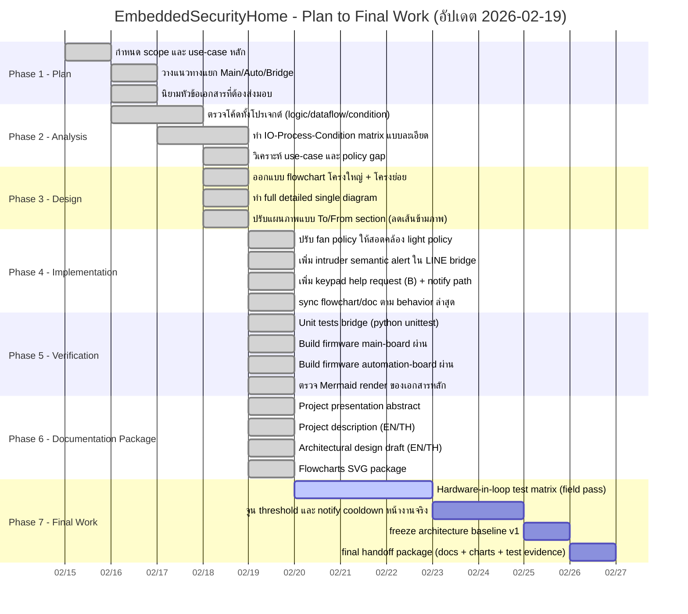

# Gantt Chart: ตั้งแต่ Plan ถึง Final Work

```mermaid
gantt
    title EmbeddedSecurityHome - Plan to Final Work (อัปเดต 2026-02-19)
    dateFormat  YYYY-MM-DD
    axisFormat  %m/%d

    section Phase 1 - Plan
    กำหนด scope และ use-case หลัก                        :done, p1, 2026-02-15, 1d
    วางแนวทางแยก Main/Auto/Bridge                        :done, p2, 2026-02-16, 1d
    นิยามหัวข้อเอกสารที่ต้องส่งมอบ                       :done, p3, 2026-02-16, 1d

    section Phase 2 - Analysis
    ตรวจโค้ดทั้งโปรเจกต์ (logic/dataflow/condition)       :done, a1, 2026-02-16, 2d
    ทำ IO-Process-Condition matrix แบบละเอียด            :done, a2, 2026-02-17, 2d
    วิเคราะห์ use-case และ policy gap                    :done, a3, 2026-02-18, 1d

    section Phase 3 - Design
    ออกแบบ flowchart โครงใหญ่ + โครงย่อย               :done, d1, 2026-02-18, 1d
    ทำ full detailed single diagram                        :done, d2, 2026-02-18, 1d
    ปรับแผนภาพแบบ To/From section (ลดเส้นข้ามภาพ)       :done, d3, 2026-02-18, 1d

    section Phase 4 - Implementation
    ปรับ fan policy ให้สอดคล้อง light policy             :done, i1, 2026-02-19, 1d
    เพิ่ม intruder semantic alert ใน LINE bridge           :done, i2, 2026-02-19, 1d
    เพิ่ม keypad help request (B) + notify path            :done, i3, 2026-02-19, 1d
    sync flowchart/doc ตาม behavior ล่าสุด                 :done, i4, 2026-02-19, 1d

    section Phase 5 - Verification
    Unit tests bridge (python unittest)                    :done, v1, 2026-02-19, 1d
    Build firmware main-board ผ่าน                         :done, v2, 2026-02-19, 1d
    Build firmware automation-board ผ่าน                   :done, v3, 2026-02-19, 1d
    ตรวจ Mermaid render ของเอกสารหลัก                     :done, v4, 2026-02-19, 1d

    section Phase 6 - Documentation Package
    Project presentation abstract                           :done, doc1, 2026-02-19, 1d
    Project description (EN/TH)                            :done, doc2, 2026-02-19, 1d
    Architectural design draft (EN/TH)                     :done, doc3, 2026-02-19, 1d
    Flowcharts SVG package                                  :done, doc4, 2026-02-19, 1d

    section Phase 7 - Final Work
    Hardware-in-loop test matrix (field pass)              :active, f1, 2026-02-20, 3d
    จูน threshold และ notify cooldown หน้างานจริง         :f2, 2026-02-23, 2d
    freeze architecture baseline v1                         :f3, 2026-02-25, 1d
    final handoff package (docs + charts + test evidence)  :f4, 2026-02-26, 1d
```

