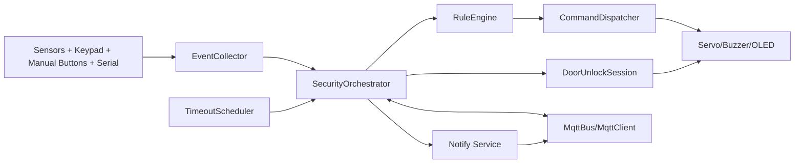
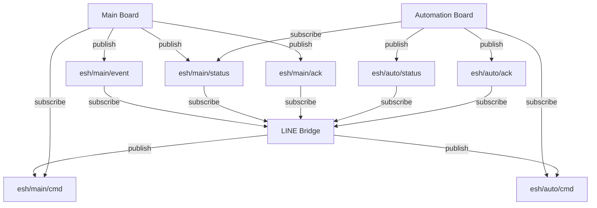

# Block Diagram (EmbeddedSecurityHome)

เอกสารนี้เป็น Block Diagram สำหรับใช้ในรายงาน/พรีเซนต์ โดยเน้นโครงระบบและความสัมพันธ์ของแต่ละบอร์ด

## 1) System-Level Block Diagram

```mermaid
flowchart LR
  U[User]
  LINE[LINE OA]
  BR[LINE Bridge<br/>FastAPI + MQTT Client]
  MQ[MQTT Broker]
  MAIN[Main Board ESP32<br/>Security Logic]
  AUTO[Automation Board ESP32<br/>Light/Fan Logic]

  SSEC[Sensors: Reed, PIR, Vibration,<br/>Ultrasonic, Keypad, Buttons]
  ASEC[Actuators: Door/Window Servo,<br/>Buzzer, OLED]
  SAUTO[Sensors: BH1750, DHT]
  AAUTO[Actuators: Light LED, Fan(L293D)]

  U --> LINE
  LINE --> BR
  BR <--> MQ
  MQ <--> MAIN
  MQ <--> AUTO

  SSEC --> MAIN --> ASEC
  SAUTO --> AUTO --> AAUTO
```

## 2) Main Board Internal Block Diagram



## 3) Automation Board Internal Block Diagram

```mermaid
flowchart LR
  IN2[BH1750 Lux + DHT Temp/Humidity]
  CTX[Main Context via MQTT<br/>mode + someone_home]
  AR[AutomationRuntime]
  PR[Presence State]
  AP[AutomationPipeline<br/>light_system + temp_system]
  OA[OutputActuator]
  OUT[Light LED + Fan(L293D)]
  AMQ[Auto MQTT Status/Ack]

  IN2 --> AR
  CTX --> AR
  AR --> PR
  AR --> AP --> OA --> OUT
  AR --> AMQ
```

## 4) Communication Block (Topics)


