# Logic Flowcharts Hierarchy

Logic-only view of the project flow.
Excluded from this document:
- Debounce details
- Sensor health monitoring details

## Level 0: Whole System

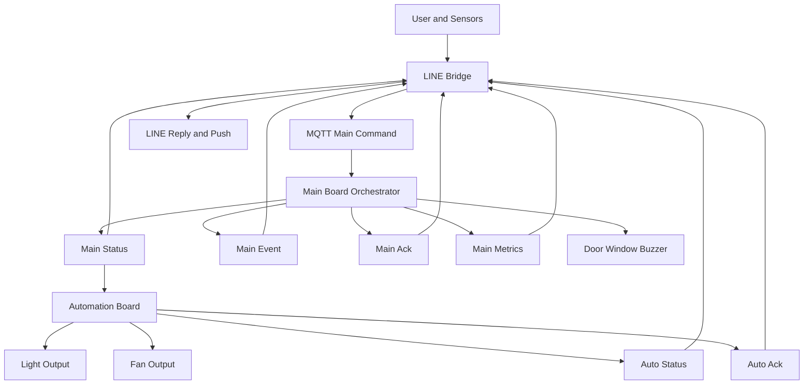

## Level 1: Main Board Major Flow

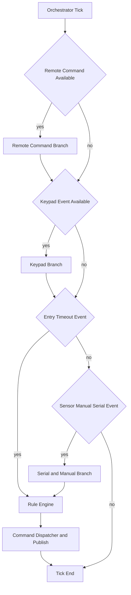

## Level 2.1: Main Board Remote Command Branch

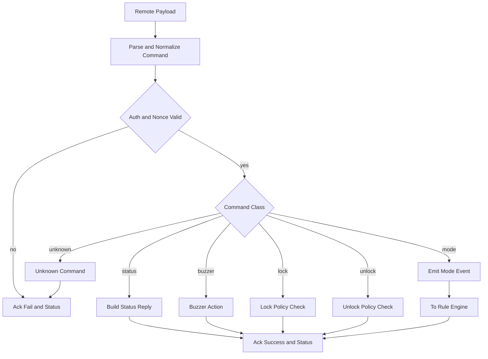

## Level 3.1: Main Board Unlock Policy

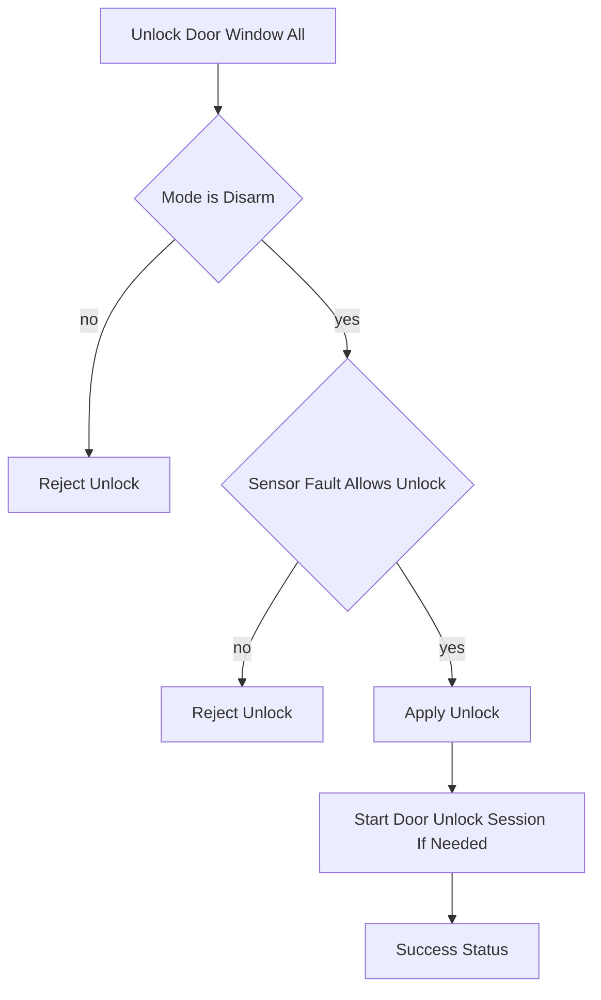

## Level 2.2: Main Board Keypad Branch

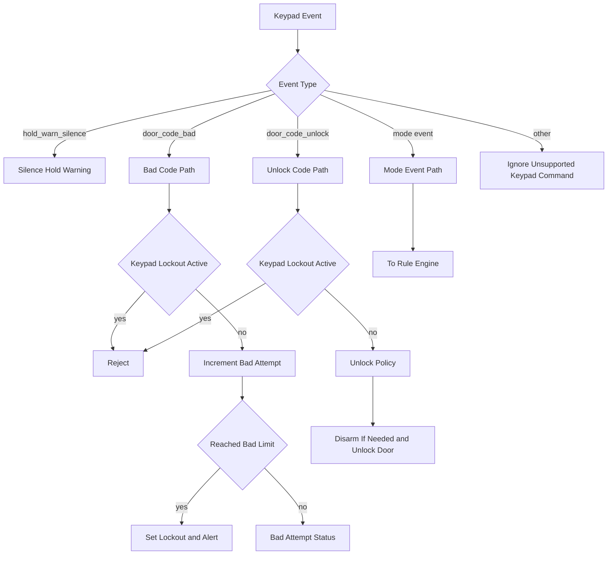

## Level 2.3: Main Board Serial and Manual Branch

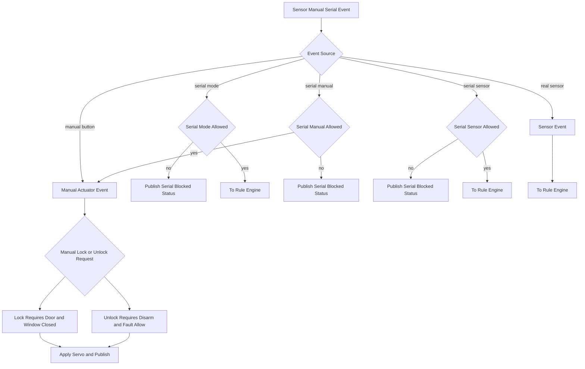

## Level 2.4: Main Board Rule Engine

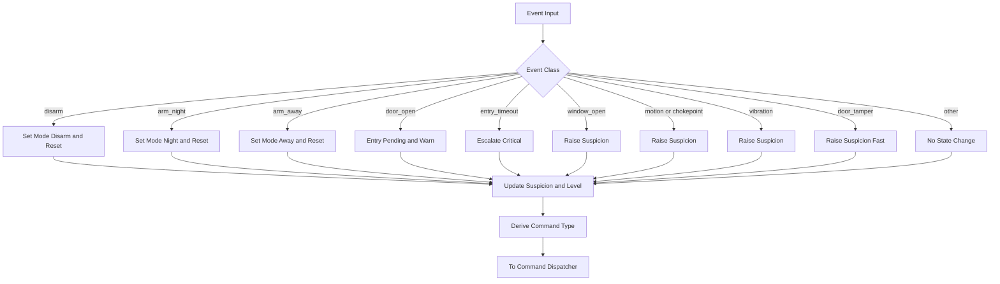

## Level 2.5: Main Board Output Dispatcher

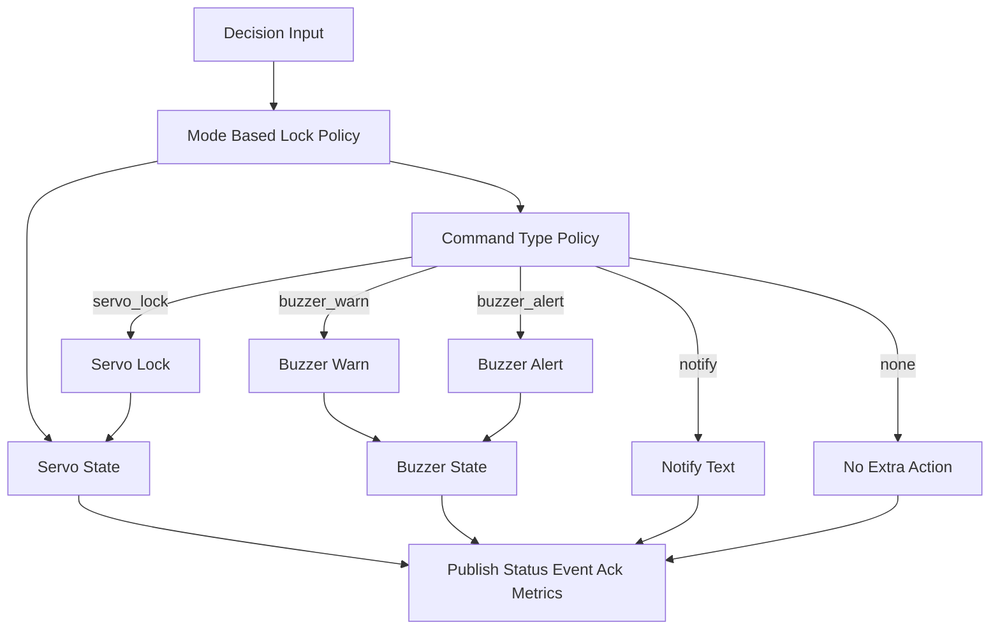

## Level 1: Automation Board Major Flow

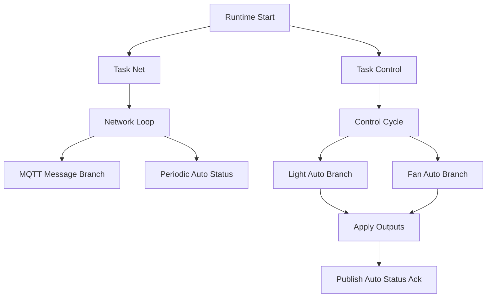

## Level 2.6: Automation MQTT Message Branch

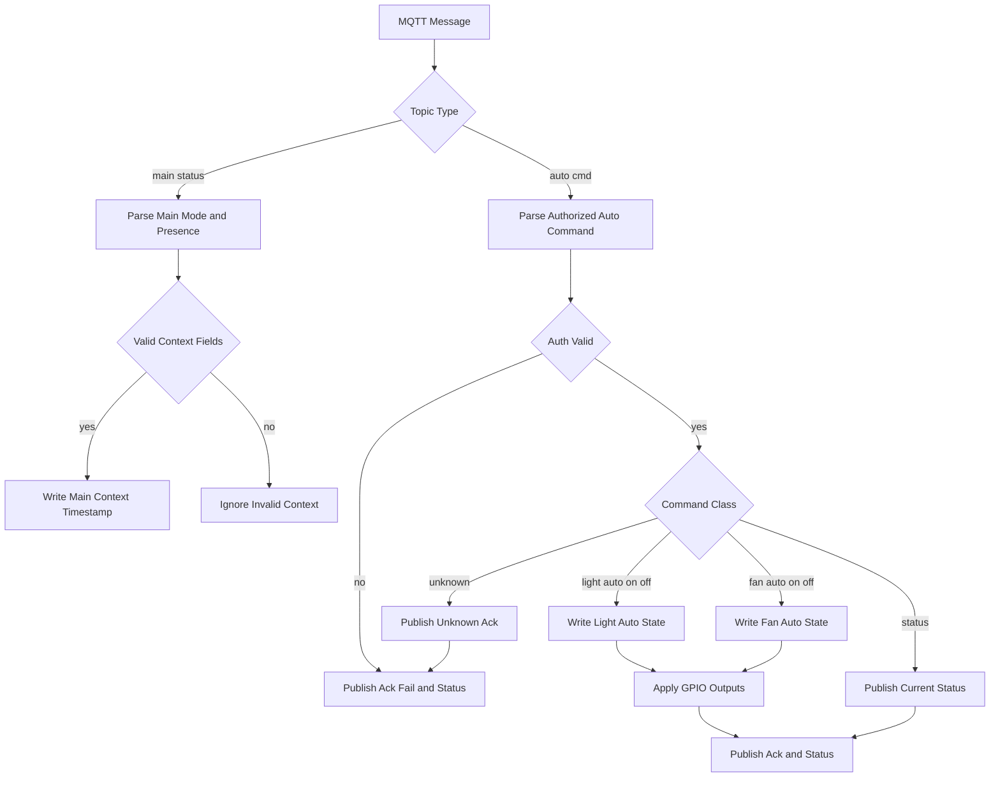

## Level 2.7: Automation Control Loop

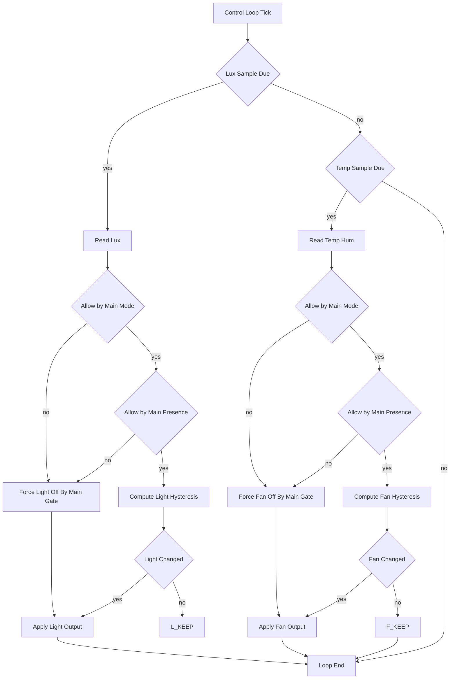

## Level 3.2: Light Auto Decision

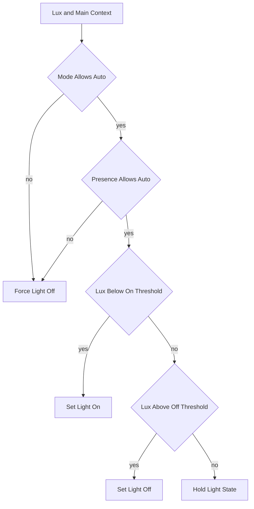

## Level 3.3: Fan Auto Decision

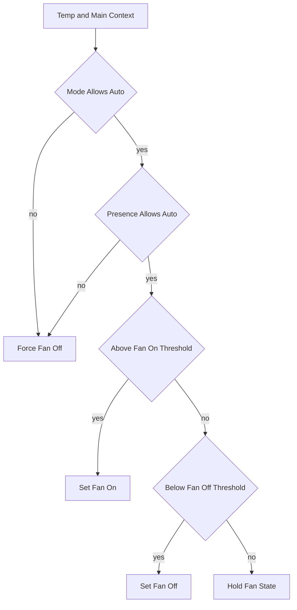

## Level 1: LINE Bridge Major Flow

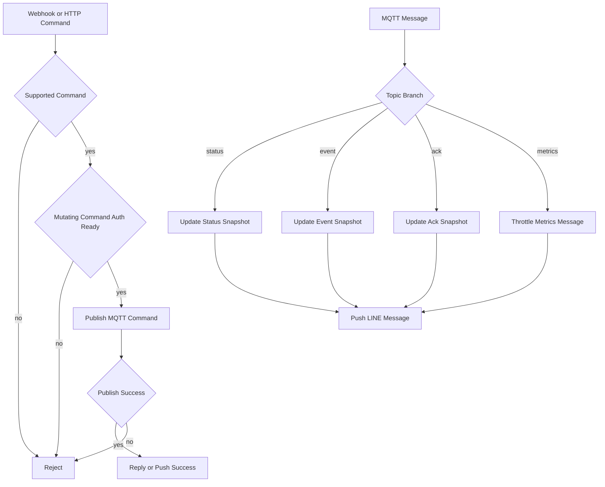

## Level 2.8: Bridge Command Ingress

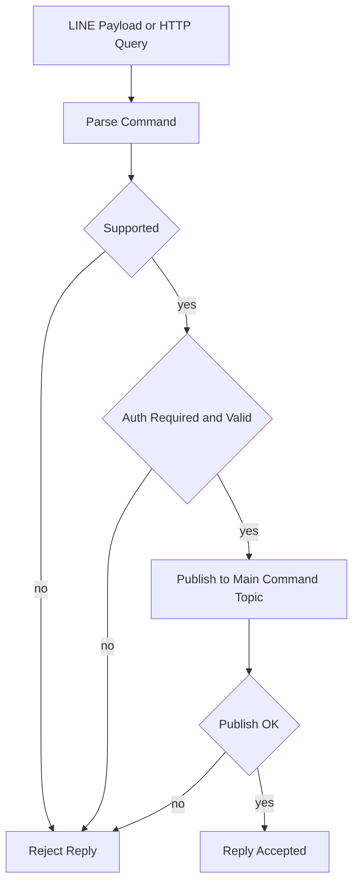

## Level 2.9: Bridge MQTT Message Fanout

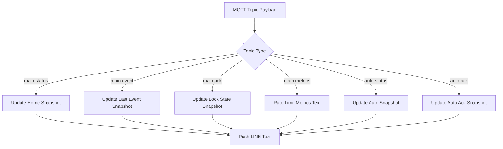
