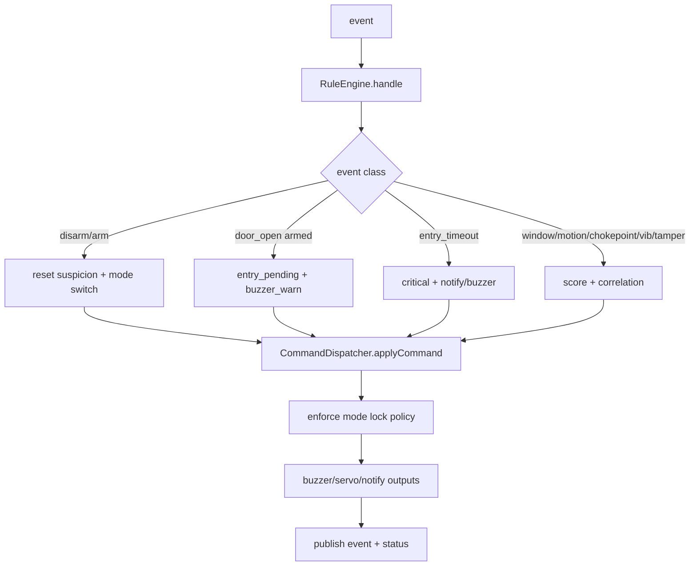
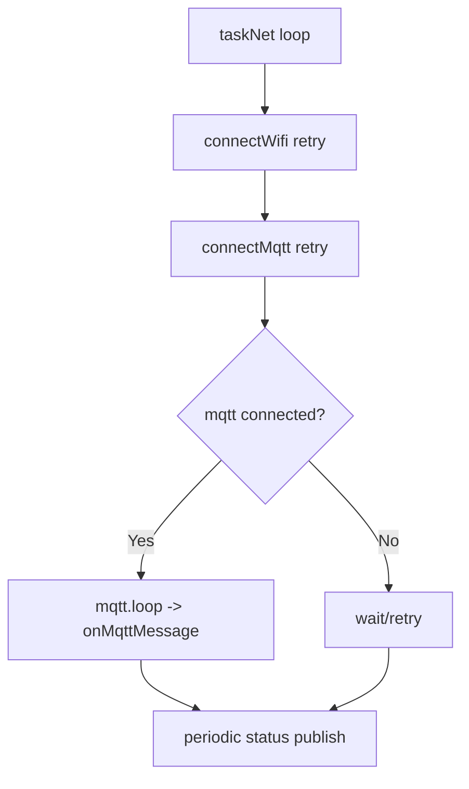
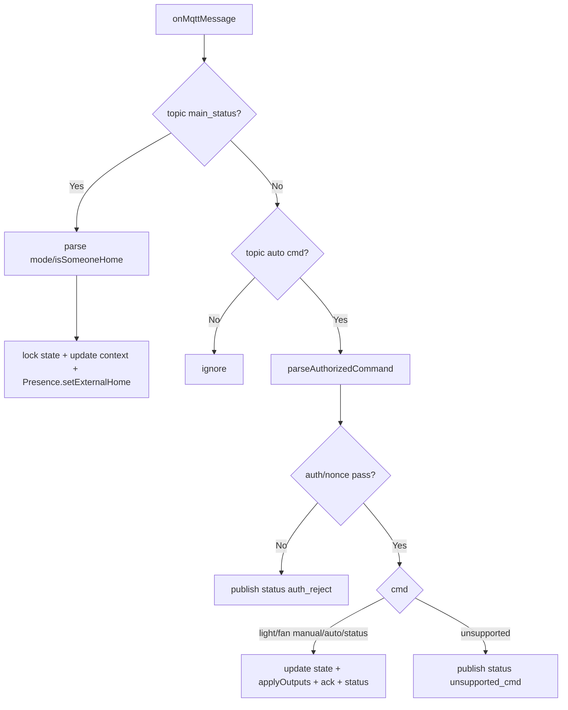
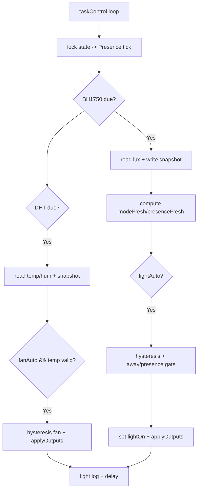
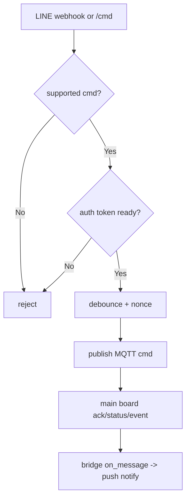

# System Dataflow and Flowcharts (Code-Accurate)

อ้างอิงโค้ดปัจจุบันจาก:
- `src/main_board/main.cpp`
- `src/main_board/app/SecurityOrchestrator.cpp`
- `src/main_board/pipelines/EventCollector.cpp`
- `src/main_board/app/RuleEngine.cpp`
- `src/main_board/services/CommandDispatcher.cpp`
- `src/auto_board/runtime/main.cpp`
- `src/auto_board/automation/presence.cpp`
- `tools/line_bridge/bridge.py`

## 1) End-to-End Input -> Output (ทั้งโปรเจค)
```mermaid
flowchart TD
  U1[Input: LINE user action] --> LB1[LINE Bridge webhook/http]
  LB1 --> LB2{cmd supported?}
  LB2 -->|No| LB3[reject]
  LB2 -->|Yes lock/unlock only| LB4{auth token ready?}
  LB4 -->|No| LB3
  LB4 -->|Yes| LB5[encode token|nonce|cmd]
  LB5 --> MQTTCMD[Publish MQTT cmd]

  MQTTCMD --> MB1[Main Board: mqttBus.pollCommand]
  MB1 --> MB2[SecurityOrchestrator.processRemoteCommand]
  MB2 --> MB3{auth + nonce + replay pass?}
  MB3 -->|No| MB4[ack reject + status reject]
  MB3 -->|Yes| MB5{policy pass? mode/sensor-fault/open-contact}
  MB5 -->|No| MB6[ack reject + status]
  MB5 -->|Yes| MB7[actuator change: servo/buzzer]
  MB7 --> MB8[status/event/ack publish]

  S1[Input: Door/Window/PIR/Vib/Ultrasonic/Keypad/Button/Serial] --> EC1[EventCollector]
  EC1 --> MB9[SecurityOrchestrator.tick]
  MB9 --> MB10{manual/mode/rule path}
  MB10 --> MB11[RuleEngine + CommandDispatcher]
  MB11 --> MB7
  MB11 --> MB8

  MB8 --> AUTOCTX[Main status topic]
  AUTOCTX --> AB1[Auto Board onMqttMessage main-status]
  AB1 --> AB2[update main mode/presence context]

  AIN1[Input: BH1750 lux + DHT temp/hum] --> AB3[Auto taskControl]
  AB2 --> AB3
  AB3 --> AB4{auto mode + hysteresis + freshness gate}
  AB4 --> AB5[LED/L293D fan output]
  AB5 --> AB6[auto status publish]

  MB8 --> LB6[LINE Bridge MQTT on_message]
  AB6 --> LB6
  LB6 --> LB7[format + push notify]
```

## 2) Main Board Flow (Security Critical Path)

### 2.1 Boot + Main Loop
```mermaid
flowchart TD
  A[setup] --> B[App.begin]
  B --> C[SecurityOrchestrator.begin]
  C --> D[collector.begin + mqttBus.begin]
  D --> E[load nonce floor from Preferences]
  E --> F[init buzzer/servo + pre-lock if contact closed]
  F --> G[publish boot status]
  G --> H[loop -> App.tick(now)]
  H --> I[SecurityOrchestrator.tick(now)]
```

### 2.2 Tick Decision Pipeline
```mermaid
flowchart TD
  T0[tick()] --> T1[update buzzer/servo waveforms]
  T1 --> T2[update sensor health]
  T2 --> T3[update door unlock session]
  T3 --> T4[mqttBus.update + heartbeat status]

  T4 --> T5{remote cmd queued?}
  T5 -->|Yes| T6[processRemoteCommand]
  T6 --> T7[refresh OLED countdown]

  T7 --> T8{keypad event?}
  T8 -->|Yes| T9{door_code_bad/unlock/mode/silence}
  T9 --> T10[lockout + disarm/unlock gate + ack/status]

  T10 --> T11{entry timeout?}
  T11 -->|Yes| T12[applyDecision(entry_timeout)]

  T11 --> T13{sensor/manual/serial event?}
  T13 -->|No| T14[return]
  T13 -->|Yes| T15{serial policy block?}
  T15 -->|Blocked| T16[status(serial blocked)]
  T15 -->|Allowed| T17{manual/mode/normal}
  T17 -->|manual| T18[manual lock/unlock policy]
  T17 -->|mode| T19[processModeEvent]
  T17 -->|normal| T20[applyDecision(rule)]
```

### 2.3 Rule Engine + Actuator Output


## 3) Automation Board Flow (Local Autonomy + Context-aware)

### 3.1 Boot + Tasks
```mermaid
flowchart TD
  A[setup] --> B[Presence.init + create state mutex]
  B --> C[WiFi/MQTT init + nonce floor load]
  C --> D[BH1750 probe + DHT init + outputs safe]
  D --> E[connectWifi/connectMqtt + boot status]
  E --> F[start taskControl(core1)]
  E --> G[start taskNet(core0)]
```

### 3.2 `taskNet`


### 3.3 `onMqttMessage`


### 3.4 `taskControl`


## 4) LINE Bridge Flow (ขอบเขตสั่งงาน)

- รับคำสั่งเฉพาะ `lock/unlock` เท่านั้น (`is_supported_cmd`)
- บังคับมี `BRIDGE_CMD_TOKEN/FW_CMD_TOKEN` ก่อนส่งคำสั่ง
- ใส่ nonce monotonic แล้วส่ง `token|nonce|cmd`
- `/health` รายงาน `cmd_auth_token_missing` เมื่อยังไม่พร้อม



## 5) วิเคราะห์ความรัดกุม (รอบล่าสุด)

### จุดที่รัดกุมแล้ว
- Main board remote mutating commands ถูก fail-closed เมื่อไม่มี token/nonce ที่ถูกต้อง
- Anti-replay ครบทั้ง TTL cache + monotonic floor ข้าม reboot
- Unlock path บังคับ `mode=disarm` และ block เมื่อ sensor fault (ถ้าเปิด policy)
- Keypad brute-force lockout + cooldown notify ทำงานครบ
- Door unlock session ครอบคลุม timeout, open-hold warn, auto-relock
- Auto board แยก task network/control ชัดเจน และ reconnect ไม่ block control loop
- Auto board ใช้ main-context freshness (`MAIN_CONTEXT_STALE_MS`) กันใช้ค่าค้าง
- Shared state บน auto board ถูกป้องกันด้วย mutex timeout + cooldown warning
- Auto board publish `ack` แยกบน `MQTT_TOPIC_ACK` สำหรับทุก command path (ok/reject)
- Auto board fail-fast ทันทีถ้า `xSemaphoreCreateMutex()` ล้มเหลว
- Main board block serial synthetic sensor events โดย default (`ALLOW_SERIAL_SENSOR_COMMANDS_DEFAULT=0`)
- LINE bridge จำกัดคำสั่งเหลือ lock/unlock และ fail-closed ถ้า token ขาด

### Residual risk ที่ยังเหลือ (ไม่ใช่บั๊กแตกทันที แต่เป็น production-hardening backlog)
- ถ้ามีการ override build flag ให้เปิด `ALLOW_SERIAL_SENSOR_COMMANDS_DEFAULT=1` จะเปิดช่อง serial injection กลับมา
- Security transport พึ่งพา MQTT channel security ภายนอก (TLS/network segmentation ต้องจัดจาก infra)

## 6) Re-check รอบนี้
- `./.venv_pio/bin/pio run -e automation-board` ผ่าน
- `./.venv_pio/bin/pio run -e main-board` ผ่าน
- `./tools/run_native_flow_tests.sh` ผ่าน
- `python3 -m py_compile tools/line_bridge/bridge.py` ผ่าน
- static check ที่เจอเป็นระดับ style/3rd-party เป็นหลัก ไม่พบบั๊กใหม่ระดับ functional/critical
