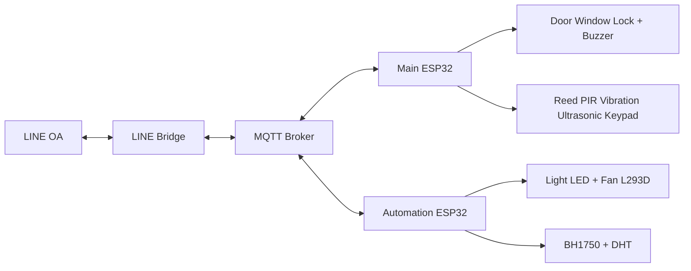
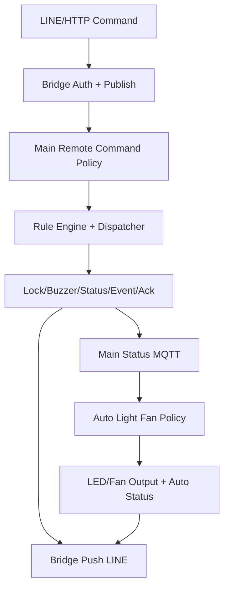

# EmbeddedSecurityHome: Project Presentation (Abstract)

เอกสารนี้เป็นสรุปแบบพร้อมนำเสนอ โดยตั้งใจให้ “อ่านจบแล้วเข้าใจภาพรวมได้ในตัว” ครอบคลุมหัวข้อ:
- ลักษณะชิ้นงาน
- การใช้งาน
- แผนการทำงาน
- hardware design
- circuit
- flowchart
- code
- test result

วันที่สรุป: 18 กุมภาพันธ์ 2026

---

## 1) ลักษณะชิ้นงาน

`EmbeddedSecurityHome` เป็นระบบความปลอดภัยภายในบ้านแบบฝังตัว (Embedded + IoT) ที่แยกการทำงานเป็น 3 ส่วนหลัก:
- `Main Board (ESP32)` ดูแลความปลอดภัยหลัก เช่น โหมดระบบ, ล็อกประตู/หน้าต่าง, เซ็นเซอร์บุกรุก, buzzer alarm
- `Automation Board (ESP32)` ดูแลระบบอัตโนมัติภายในบ้าน เช่น ไฟและพัดลม โดยอิงบริบทจาก Main Board
- `LINE Bridge (Python)` เชื่อม MQTT กับ LINE OA เพื่อสั่งงานและรับสถานะผ่านแชต

จุดเด่นของชิ้นงาน:
- ควบคุมผ่าน LINE ได้จริง
- มีการแยก board ตามหน้าที่ ลด coupling
- รองรับโหมด manual/auto พร้อม fallback policy เมื่อข้อมูลขาดหาย
- มีชั้นป้องกันคำสั่งสำคัญด้วย token + nonce (anti-replay)

---

## 2) การใช้งาน

ลำดับใช้งานจริงของผู้ใช้:
1. เปิดระบบ Bridge และเชื่อม Webhook LINE
2. ส่งคำสั่งใน LINE เช่น `lock door`, `unlock all`, `status`
3. Bridge ส่งคำสั่งเข้า MQTT ไปยัง Main Board
4. Main Board ตรวจ policy ก่อนสั่ง actuator และส่ง status/event/ack กลับ
5. Automation Board รับ context จาก Main Board แล้วตัดสินใจไฟ/พัดลมอัตโนมัติ
6. Bridge push ผลลัพธ์กลับไปที่ LINE

Use case หลัก:
- โหมดป้องกันบ้าน: arm/disarm + intrusion detection
- โหมดใช้งานประจำวัน: เปิด auto ไฟ/พัดลม
- โหมดควบคุมตรง: สั่ง lock/unlock และสั่ง light/fan ผ่าน command topic

---

## 3) แผนการทำงาน

แผนงานแบ่งเป็น 4 ช่วง:

1. Foundation
- แยกสถาปัตยกรรม Main/Auto/Bridge
- วาง topic contract MQTT (`esh/main/*`, `esh/auto/*`)

2. Core Security
- พัฒนา SecurityOrchestrator + RuleEngine
- เชื่อม keypad/sensors/servo/buzzer + state machine

3. Automation & Integration
- พัฒนา light/fan hysteresis
- ผูก auto policy กับบริบทจาก main (`mode`, `isSomeoneHome`)
- เชื่อม LINE Bridge เพื่อใช้งานจริง

4. Validation & Presentation
- build firmware ทั้งสองบอร์ด
- รัน unit tests ฝั่ง bridge
- จัดทำ flowchart และเอกสารนำเสนอ

---

## 4) Hardware Design

### 4.1 System Architecture

### 4.2 บทบาทฮาร์ดแวร์แต่ละบอร์ด

- Main Board
  - อินพุต: reed, PIR, vibration, ultrasonic, keypad, manual buttons
  - เอาต์พุต: servo lock 2 ช่อง, buzzer, OLED
- Automation Board
  - อินพุต: BH1750 (lux), DHT (temp/humidity), main context ผ่าน MQTT
  - เอาต์พุต: LED light, fan ผ่าน L293D

---

## 5) Circuit

### 5.1 Main Board (อ้างอิง `src/main_board/app/HardwareConfig.h`)

| Function | GPIO |
|---|---|
| Buzzer | 25 |
| Servo1 / Servo2 | 26 / 27 |
| Reed Door / Window | 32 / 19 |
| PIR1 / PIR2 / PIR3 | 35 / 36 / 39 |
| Vibration | 34 |
| Ultrasonic #1 TRIG/ECHO | 13 / 14 |
| Ultrasonic #2 TRIG/ECHO | 16 / 17 |
| Ultrasonic #3 TRIG/ECHO | 4 / 5 |
| Manual Door / Window Button | 33 / 18 |
| I2C SDA / SCL | 21 / 22 |

### 5.2 Automation Board (อ้างอิง `src/auto_board/hardware/AutoHardwareConfig.h`)

| Function | GPIO |
|---|---|
| Light LED | 27 |
| L293D IN1 / IN2 / EN | 25 / 26 / 33 |
| DHT Data | 32 |
| I2C SDA / SCL | 21 / 22 |

### 5.3 วงจรเชิงระบบ
- Main และ Auto board ใช้ MQTT broker ร่วมกัน
- Bridge เป็น software gateway เชื่อม LINE กับ MQTT
- เส้นทางควบคุมความปลอดภัยวิ่งผ่าน Main Board เป็นหลัก
- เส้นทาง automation (light/fan) อยู่ใน Auto Board แต่ใช้ context จาก Main Board

---

## 6) Flowchart

ไฟล์ flowchart สำหรับการนำเสนอ:
- `docs/flowcharts.md` (hierarchical)
- `docs/flowcharts_svg/README.md` (SVG แยกรายหัวข้อ)
- `docs/full_system_flow_detailed.svg` (ภาพรวมใหญ่)

ภาพรวม logic:

---

## 7) Code

### 7.1 โครงสร้างหลัก
- Main board entry: `src/main_board/main.cpp`
- Security orchestration: `src/main_board/app/SecurityOrchestrator.cpp`
- Rule decision: `src/main_board/app/RuleEngine.cpp`
- Auto runtime: `src/auto_board/app/AutomationRuntime.cpp`
- Automation policy:
  - `src/auto_board/automation/light_system.cpp`
  - `src/auto_board/automation/temp_system.cpp`
- LINE bridge: `tools/line_bridge/bridge.py`

### 7.2 ประเด็นตรรกะสำคัญ
- คำสั่ง remote ฝั่ง firmware ใช้ payload `token|nonce|cmd`
- มี replay protection ด้วย nonce monotonic
- unlock ถูกคุมด้วย mode และ fault policy
- light/fan auto ใช้ hysteresis
- fan policy ปัจจุบันปรับให้สอดคล้องกับ light policy:
  - auto ปิดอยู่ => คงสถานะเดิม
  - main gate ไม่ผ่าน => บังคับ OFF
  - sensor invalid => คงสถานะเดิม

---

## 8) Test Result

ผลทดสอบที่รันจริง ณ วันที่ 18 กุมภาพันธ์ 2026:

1. Build firmware
- `python -m platformio run -e automation-board` : SUCCESS
  - RAM 13.9% (45,632 / 327,680)
  - Flash 59.7% (782,493 / 1,310,720)
- `python -m platformio run -e main-board` : SUCCESS
  - RAM 17.1% (56,000 / 327,680)
  - Flash 63.0% (825,137 / 1,310,720)

2. Bridge tests
- `python -m unittest test.bridge.test_bridge -v` : PASS 12/12
  - ครอบคลุม command publish, auth reject, signature verify, snapshot update

3. Syntax check
- `python -m py_compile tools/line_bridge/bridge.py` : PASS

4. Flowchart rendering check
- Mermaid blocks จาก `docs/flowcharts.md` render ผ่าน 16/16

ข้อจำกัดผลทดสอบรอบนี้:
- ยังไม่มี hardware-in-the-loop test report (เช่น sensor trigger กับของจริงทุกตัวในภาคสนาม)

---

## 9) สรุปสำหรับการนำเสนอ

โครงงานนี้พร้อมในระดับ “ระบบใช้งานจริงแบบ end-to-end” ตั้งแต่รับคำสั่งผู้ใช้ผ่าน LINE ไปจนถึงการควบคุม actuator และรายงานสถานะกลับ โดยมีการแยกสถาปัตยกรรมชัดเจน (Main vs Auto) และมี policy ความปลอดภัยใน command path ที่ตรวจสอบได้จากโค้ดและผลทดสอบ build/test ล่าสุด.

